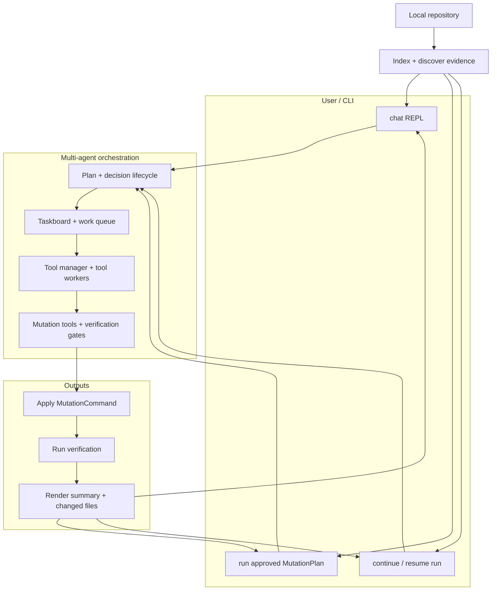

# mana-agent

> Multi-agent-powered repository analysis, evidence-backed Q&A, and tool-aware coding automation for local codebases.

`mana-agent` is an installable Python CLI for understanding and safely changing software projects. It can index a repository, run static and dependency analysis, generate structured reports, answer repository-grounded questions, and drive a constrained coding agent that can inspect files, apply patches, use Git tools, and run verification commands.

## Adaptive repository skills

Mana-Agent can retain verified, reusable repository procedures as adaptive skills. Generated skills are never written into a checkout: they live under `${MANA_HOME:-~/.mana}/skills/repositories/<repository-id>/`, are candidates first, and require review/approval before activation. Existing `skills/` files remain static, user-authored skills.

Use `mana-agent skills storage-path`, `mana-agent skills candidates`, `mana-agent skills review <id>`, and `mana-agent skills approve <id>` to inspect the lifecycle. Active adaptive skills are indexed compactly and loaded only after an explicit model selection passes repository identity, status, required-tool, permission, and maximum-count checks.

Chat uses the same repository-isolated store. `/skills`, `/skills available`, `/skills selected`, `/skills explain`, `/skills disable`, `/skills enable`, `/skills review <id>`, `/skills approve <id>`, and `/skills reject <id> <reason>` operate on the current repository only. A Chat selection is recorded in the timeline and full procedure text is supplied to the coding path only after model selection and policy validation.

Optional Gmail email connector setup and security guidance: [docs/16-email-connectors.md](docs/16-email-connectors.md).

Optional model-controlled browser setup and safety guidance: [docs/17-browser-automation.md](docs/17-browser-automation.md).

**Current documented version:** `v0.0.13`

---

## Table of Contents

* [Why mana-agent?](#why-mana-agent)
* [Highlights](#highlights)
* [Features](#features)
* [Web Dashboard](#web-dashboard)
* [Automations and Cron Jobs](#automations-and-cron-jobs)
* [Interface Preview](#interface-preview)
* [How It Works](#how-it-works)
* [Requirements](#requirements)
* [Installation](#installation)
* [Latest Dev Binaries](#latest-dev-binaries)
* [Configuration](#configuration)
* [Quick Start](#quick-start)
* [CLI Reference](#cli-reference)
* [External Search](#external-search)
* [Document Files](#document-files)
* [Model-Driven Git Tools](#model-driven-git-tools)
* [Approved Mutation Plans](#approved-mutation-plans)
* [Generated Artifacts](#generated-artifacts)
* [Coding Agent Safety Model](#coding-agent-safety-model)
* [Project Layout](#project-layout)
* [Documentation](#documentation)
* [Development](#development)
* [License](#license)

---

## Why mana-agent?

Large codebases are hard to inspect, summarize, modify, and verify. `mana-agent` makes repository work more repeatable, traceable, and evidence-driven.

Use it to:

* **Analyze** a local project and generate structured reports.
* **Ask** repository-aware questions grounded in indexed code.
* **Chat** with an interactive assistant for planning, code inspection, patching, Git operations, and verification.
* **Run approved mutation plans** through a controlled execution flow.
* **Persist coding-flow state** so multi-turn tasks can continue across sessions.
* **Control file mutation** through explicit repository tools instead of unrestricted editing.
* **Work with project document files** through model-selected Word, PDF, Excel, and CSV tools.
* **Use external search** only when the model decides current web or GitHub context is needed.
* **Complete website tasks** through an isolated, model-controlled Playwright browser session.

---

## Highlights

| Area                     | What mana-agent provides                                                                               |
| ------------------------ | ------------------------------------------------------------------------------------------------------ |
| Repository understanding | Static analysis, dependency discovery, semantic index, reports, and architecture diagrams.             |
| Interactive chat         | Repository-grounded Q&A, planning mode, coding workflows, and verification loops.                      |
| Multi-agent runtime      | Main decision lifecycle, taskboard/work queue, tool manager, workers, traces, and summaries.           |
| Git automation           | Safety-checked Git tools for status, diff, branch, commit, push, pull, fetch, merge, rebase, and more. |
| Mutation safety          | Plans, constrained file tools, patch application, command gates, and verification after changes.       |
| Document files           | Capability tools for detecting, reading, querying, creating, updating, and deleting supported documents. |
| Browser automation       | Model-selected navigation, inspection, forms, tabs, uploads, downloads, screenshots, and guarded submissions. |
| Search memory            | Optional web/GitHub search with cached results under `.mana/search_memory.jsonl`.                      |
| Artifacts                | JSON, Markdown, HTML, DOT, GraphML, and Mermaid outputs.                                               |

---

## Features

### Repository analysis

`mana-agent` can inspect a project directory and generate artifacts for automation, documentation, and review.

Supported analysis outputs:

* JSON
* Markdown
* HTML
* DOT graph
* GraphML
* Mermaid diagram

### Interactive coding assistant

The `chat` command opens an interactive REPL for repository Q&A and coding workflows.

It supports:

* Repository-aware answers
* Planning mode
* Coding memory
* Tool-worker execution paths
* Mermaid diagram rendering
* Multi-step coding-agent loops
* Verification after changes when supported
* Model-selected Git tools
* Model-selected document tools for `.docx`, `.pdf`, `.xlsx`, `.xlsm`, and `.csv`
* Optional external web and GitHub search
* Optional Playwright browser tools for multi-step website tasks
* Final summaries with changed files, checks, skipped checks, and warnings

### Multi-agent orchestration

`mana-agent` is designed around a multi-agent workflow with:

* Main decision/planning lifecycle
* Taskboard and work queue
* Tool manager
* Tool workers
* Mutation tools
* Verification gates
* Execution traces
* Final summaries

### Approved mutation execution

For deterministic changes, `mana-agent` can execute an approved mutation plan:

```bash
mana-agent run --root-dir /path/to/project --plan-id mp_a672168ef9c0
```

This separates planning and approval from actual mutation execution.

## Web Dashboard

Install the dashboard extra and start the UI from any repository:

```bash
pip install "mana-agent[dashboard]"
mana-agent dashboard --root-dir .
```

The dashboard uses the same repository context, services, and multi-agent runtime
as the CLI. Its sidebar is the dashboard's single navigation menu rather than
a group of mode checkboxes or duplicate multipage links.

Dashboard pages include:

* **Overview** — repository status, index health, recent activity, and quick actions.
* **Chat** — repository-grounded questions and coding-agent workflows.
* **Analysis** — run analysis and inspect generated reports and diagrams.
* **Taskboard** — active and completed agent tasks, workers, and execution state.
* **Traces** — tool calls, decisions, verification results, and runtime events.
* **Observability** — local redacted trace trees, span timings, token usage, latency/error metrics, queue waits, and evidence-backed bottleneck findings.
* **Automations** — create and manage persistent scheduled actions.
* **Cron Jobs** — inspect deployment state, enable or disable schedules, and remove deployments.
* **Settings** — provider, model-role, search, and runtime configuration.

Dashboard actions use the same validation and safety rules as their CLI
equivalents. Destructive operations are never implied by page navigation or
selection state.

For dashboard development, the Streamlit entry point can also be run directly:

```bash
streamlit run dashboard/app.py -- --root-dir .
```

### Observability and OTLP export

Mana-Agent stores dashboard telemetry per repository under `~/.mana/repositories/<repository_id>/observability/telemetry.sqlite`.
Payloads are bounded, structured summaries with common credentials redacted. Data is retained for 30 days and up to 500 MB by default; change these limits with `MANA_OBSERVABILITY_RETENTION_DAYS` and `MANA_OBSERVABILITY_MAX_STORAGE_MB`.

Install optional OpenTelemetry support with `pip install "mana-agent[observability]"`. Export remains disabled until `MANA_OBSERVABILITY_OTLP_ENDPOINT` is set; use `MANA_OBSERVABILITY_OTLP_HEADERS` for a JSON object of endpoint headers. Local tracing remains authoritative if an export fails. The dashboard tracks exact or estimated tokens only—no dollar cost is displayed until a model-price policy is configured.

---

## Automations and Cron Jobs

Schedules are stored in `.mana/automations/config.json` and are created only by
an explicit CLI or dashboard request. Each schedule has a stable ID, action,
cron expression, deployment target, enabled state, and deployment metadata.

A schedule can target:

* **Local cron** — runs on the current machine under the user who deployed it.
* **GitHub Actions** — runs in the repository through a managed workflow.
* **Both** — maintains local and GitHub deployments from one Mana-Agent schedule.

Install automation dependencies when they are not already included:

```bash
pip install "mana-agent[automations]"
```

Create a schedule and deploy it immediately:

```bash
mana-agent automation create \
  --name "Nightly analysis" \
  --action analyze \
  --cron "0 2 * * *" \
  --target local \
  --target github \
  --deploy

mana-agent automation list
mana-agent automation status sch_<id>
```

Common lifecycle commands:

```bash
mana-agent automation enable sch_<id>
mana-agent automation disable sch_<id>
mana-agent automation deploy sch_<id>
mana-agent automation run sch_<id>
mana-agent automation remove sch_<id>
```

Local cron uses the host system timezone. GitHub Actions schedules use UTC.
Mana-Agent generates one managed workflow per GitHub-targeted schedule. The
workflow installs the package with the extras required by the selected action,
runs that action, uploads `.mana/` results as workflow artifacts, and exposes
`workflow_dispatch` for manual runs.

When GitHub deployment requires repository changes, Mana-Agent creates or
updates the managed workflow on the current feature branch. It must show the
planned file and Git operations before commit or push, and it must not silently
modify the default branch. The workflow becomes active when the change reaches
the repository's default branch.

The dashboard provides the same create, list, status, deploy, run, enable,
disable, and remove lifecycle. Deployment state is derived from the actual
target—not only from the local schedule configuration—so missing or drifted
cron entries and workflows are visible.

---

## Interface Preview

Example chat startup layout:

```text
Mana-Agent v0.0.12
repo: /path/to/project
index: .mana/index ready
mode: chat
coding-agent: enabled
coding-memory: enabled

Ask about your repository or request edits.
```

Example in-chat analysis menu:

```text
/analyze

Select output format:

1. JSON
2. Markdown
3. HTML
4. DOT graph
5. GraphML
6. Mermaid diagram
7. All formats

Enter choice:
```

Example coding workflow summary:

```text
Plan created
Tool calls completed
Patch applied
Verification passed

Changed files:
- src/example.py
- tests/test_example.py
```

---

## How It Works



For a standalone diagram, see:

```text
docs/07-diagram.md
```

---

## Requirements

* Python **3.10 through 3.14**
* An OpenAI-compatible chat endpoint
* An OpenAI-compatible embedding endpoint
* API keys and model configuration
* Local repository access

The default dependency set uses CPU FAISS for local vector search. Redis/RQ support is available for optional tool-worker execution paths.

---

## Installation

### Option 1: Install from GitHub with `pipx`

```bash
pipx install git+https://github.com/ah2727/mana-agent.git
```

Confirm the CLI is available:

```bash
mana-agent --help
```

### Option 2: Local editable install

Clone the repository:

```bash
git clone https://github.com/ah2727/mana-agent.git
cd mana-agent
```

Create and activate a virtual environment:

```bash
python3 -m venv .venv
source .venv/bin/activate
```

Install the project:

```bash
python -m pip install --upgrade pip
python -m pip install -e .
```

Install common development tools:

```bash
python -m pip install pytest ruff mypy
```

Install the managed Chromium runtime before using browser tools:

```bash
python -m playwright install chromium
```

Check the CLI:

```bash
mana-agent --help
```

---

## Latest Dev Binaries

You can download the latest development prerelease binary from the `latest-dev` GitHub release.

### Linux x64

```bash
curl -L -o mana-agent https://github.com/ah2727/mana-agent/releases/download/latest-dev/mana-agent-linux-x64
chmod +x mana-agent
sudo mv mana-agent /usr/local/bin/mana-agent
mana-agent --help
```

### macOS Apple Silicon

```bash
curl -L -o mana-agent https://github.com/ah2727/mana-agent/releases/download/latest-dev/mana-agent-macos-arm64
chmod +x mana-agent
sudo mv mana-agent /usr/local/bin/mana-agent
mana-agent --help
```

### macOS Intel

```bash
curl -L -o mana-agent https://github.com/ah2727/mana-agent/releases/download/latest-dev/mana-agent-macos-x64
chmod +x mana-agent
sudo mv mana-agent /usr/local/bin/mana-agent
mana-agent --help
```

### Windows PowerShell

```powershell
Invoke-WebRequest -Uri "https://github.com/ah2727/mana-agent/releases/download/latest-dev/mana-agent-windows-x64.exe" -OutFile "mana-agent.exe"
.\mana-agent.exe --help
```

---

## Configuration

Run `mana-agent` in an interactive terminal for first-run setup. The CLI prints the banner first, then opens a keyboard-selectable setup wizard when no saved user config exists. The wizard stores normal settings in `~/.mana/config.toml`, secrets in `~/.mana/secrets.toml`, and fetched provider models in `~/.mana/model_cache.json`.

Mana-managed configuration is loaded only from `~/.mana/config.toml` and
`~/.mana/secrets.toml`, followed by safe defaults. Repository `.env` files and
environment variables are deliberately ignored so opening a repository cannot
silently replace the provider credentials selected in Mana-Agent's settings.
Use `mana-agent --no-interactive ...` in CI to prevent prompts; commands that
require model configuration fail clearly when `~/.mana/secrets.toml` has no
`OPENAI_API_KEY`.

The root menu includes Settings for changing the provider/API key, refreshing the model list from `GET {OPENAI_BASE_URL}/models`, changing selected models, assigning Mana model role levels, configuring web/GitHub search providers, and showing a masked config summary.

### Minimal configuration

```bash
OPENAI_API_KEY="sk-..."
OPENAI_BASE_URL="https://api.openai.com/v1"

OPENAI_CHAT_MODEL="gpt-4.1"
LLM_MODEL="gpt-4.1"
OPENAI_TOOL_WORKER_MODEL="gpt-4.1"
OPENAI_CODING_PLANNER_MODEL="gpt-4.1"
OPENAI_EMBED_MODEL="text-embedding-3-small"
MODEL_LEVEL_3_HIGH_REASONING="gpt-4.1"
MODEL_LEVEL_2_CODING="gpt-4.1"
MODEL_LEVEL_1_FAST_TOOL="gpt-4.1-mini"

DEFAULT_TOP_K=8
```

### Mutation configuration

```bash
MUTATION_MAX_STEPS=25
MUTATION_VERIFY_ON_CHANGE=1
```

### Optional model-level routing

Use `MODEL_LEVEL_*` variables for actual model IDs, and `MANA_MODEL_*` variables to map each role to one of those levels.

```bash
MODEL_LEVEL_3_HIGH_REASONING=gpt-4.1
MODEL_LEVEL_2_CODING=gpt-4.1
MODEL_LEVEL_1_FAST_TOOL=gpt-4.1-mini

MANA_MODEL_MAIN=MODEL_LEVEL_3_HIGH_REASONING
MANA_MODEL_HEAD_DECISION=MODEL_LEVEL_3_HIGH_REASONING
MANA_MODEL_PLANNER=MODEL_LEVEL_3_HIGH_REASONING
MANA_MODEL_CODING=MODEL_LEVEL_2_CODING
MANA_MODEL_VERIFIER=MODEL_LEVEL_2_CODING
MANA_MODEL_REVIEWER=MODEL_LEVEL_3_HIGH_REASONING
MANA_MODEL_TOOL=MODEL_LEVEL_1_FAST_TOOL
MANA_MODEL_SUMMARIZER=MODEL_LEVEL_1_FAST_TOOL
```

### User configuration keys

Set these through the interactive Settings menu; they are persisted under
`~/.mana` rather than read from the current repository or shell environment.

| Variable                      | Purpose                                                                          |
| ----------------------------- | -------------------------------------------------------------------------------- |
| `OPENAI_API_KEY`              | API key used for chat and embedding requests.                                    |
| `OPENAI_BASE_URL`             | Base URL for an OpenAI-compatible provider.                                      |
| `OPENAI_CHAT_MODEL`           | Default chat model for analysis and Q&A.                                         |
| `LLM_MODEL`                   | Backward-compatible alias for the default chat model.                            |
| `OPENAI_TOOL_WORKER_MODEL`    | Model used by optional tool-worker execution paths.                              |
| `OPENAI_CODING_PLANNER_MODEL` | Model used for coding-agent planning.                                            |
| `OPENAI_EMBED_MODEL`          | Embedding model used for semantic indexing.                                      |
| `DEFAULT_TOP_K`               | Default number of search results returned by retrieval workflows.                |
| `MUTATION_MAX_STEPS`          | Upper bound for tool/mutation work items per approved plan.                      |
| `MUTATION_VERIFY_ON_CHANGE`   | When `1`, run verification gates after applying mutation changes when supported. |
| `MANA_MODEL_MAIN`             | Main agent model level.                                                          |
| `MANA_MODEL_HEAD_DECISION`    | Head-decision / reasoning model level.                                           |
| `MANA_MODEL_PLANNER`          | Planning model level.                                                            |
| `MANA_MODEL_CODING`           | Coding-agent model level.                                                        |
| `MANA_MODEL_VERIFIER`         | Verification model level.                                                        |
| `MANA_MODEL_REVIEWER`         | Review model level.                                                              |
| `MANA_MODEL_TOOL`             | Fast tool-worker model level.                                                    |
| `MANA_MODEL_SUMMARIZER`       | Summary model level.                                                             |

---

## Quick Start

### 1. Open a chat session

```bash
mana-agent chat --root-dir /path/to/project
```

### 2. Start an interactive coding workflow

```bash
mana-agent chat --root-dir . --planning-mode --coding-memory
```

### 3. Run an in-chat analysis

```text
/analyze all
```

### 4. Run an approved mutation plan

```bash
mana-agent run --root-dir /path/to/project --plan-id mp_a672168ef9c0
```

The `run` command compiles the approved plan into an internal `MutationCommand` contract, then executes it using the repository mutation tool APIs.

### 5. Work with project documents

Document requests are selected by the model through tool capability metadata, not by chat keyword routing. Supported files in the current project can be detected, chunked, analyzed, queried, and safely mutated:

```text
analyze docs/report.pdf
summarize docs/report.docx
find all invoices in Excel files
update budget.xlsx sheet March cell B2 to 1200
create a Word report from this summary
query current library for payment terms
```

---

## CLI Reference

All commands support:

```bash
--help
```

Structured `--json` output is available where supported.

### `mana-agent chat`

Starts an interactive REPL for repository Q&A and coding-agent tasks.

```bash
mana-agent chat --root-dir .
```

Common options:

| Option                    | Purpose                                              |
| ------------------------- | ---------------------------------------------------- |
| `--root-dir`              | Project root for tools and coding memory.            |
| `--flow-id`               | Resume or pin a coding flow.                         |
| `--planning-mode`         | Ask planning questions before execution.             |
| `--auto-execute-plan`     | Execute generated plans.                             |
| `--full-auto`             | Continue auto-execution until completion or a limit. |
| `--coding-memory`         | Enable persisted coding-flow state.                  |
| `--no-coding-memory`      | Disable persisted coding-flow state.                 |
| `--tool-worker-process`   | Run tools through the worker-process path.           |
| `--multiline-input`       | Allow multiline REPL input.                          |
| `--diagram-render-images` | Render Mermaid diagrams to image artifacts.          |

Example:

```bash
mana-agent chat --root-dir . --planning-mode --coding-memory
```

Coding memory is stored under the analyzed project:

```text
<project>/.mana/index/chat_memory.sqlite3
```

### In-chat `/analyze`

Inside a chat session, run `/analyze` to analyze the current project and generate report artifacts under `.mana/`.

With no arguments, `/analyze` opens a format menu:

```text
/analyze

Select output format:

1. JSON
2. Markdown
3. HTML
4. DOT graph
5. GraphML
6. Mermaid diagram
7. All formats

Enter choice:
```

Direct forms skip the menu:

```bash
/analyze all
/analyze json markdown html
/analyze --format json,markdown,html
```

Aliases and notes:

* `md` is an alias for `markdown`.
* `mermaid` writes `.mana/diagram.mmd`.
* `all` generates every supported format.
* `/analyze` is read-only apart from generated `.mana/` artifacts.
* `/analyze` runs before normal chat messages reach the model.

### `mana-agent run`

Runs an approved mutation plan against a target repository.

```bash
mana-agent run --root-dir /path/to/project --plan-id mp_a672168ef9c0
```

This command is useful when you want deterministic execution after a plan has already been reviewed or approved.

Implementation note: `run` compiles the approved `MutationPlan` into an executable `MutationCommand` contract and then executes the registered mutation tools through the mutation command executor.

### `mana-agent git`

Runs explicit Git commands through Mana-Agent's Git executor and safety policy.

```bash
mana-agent git -- status
mana-agent git -- help -a
mana-agent git -- branch
mana-agent git -- log --oneline -10
mana-agent git -- diff --stat
mana-agent git -- push -u origin feature/example
```

Protected commands require explicit protected-command permission:

```bash
mana-agent git --allow-protected -- clean -fd
```

Use protected Git operations only when the risk is intentional and understood.

### `mana-agent dashboard`

Starts the web dashboard for a repository.

```bash
mana-agent dashboard --root-dir .
```

Common options:

| Option       | Purpose                                      |
| ------------ | -------------------------------------------- |
| `--root-dir` | Repository used by dashboard pages/actions.  |
| `--host`     | Dashboard bind host.                        |
| `--port`     | Dashboard listen port.                      |
| `--no-open`  | Do not open a browser automatically.        |

The command validates the optional dashboard dependencies and prints the exact
installation command if they are unavailable.

### `mana-agent automation`

Creates and manages persistent scheduled actions from the CLI.

```bash
mana-agent automation create \
  --name "Nightly analysis" \
  --action analyze \
  --cron "0 2 * * *" \
  --target local \
  --target github \
  --deploy
```

Command groups:

| Command                         | Purpose                                                   |
| ------------------------------- | --------------------------------------------------------- |
| `automation create`             | Validate and save a new schedule.                         |
| `automation list`               | List schedules and their configured targets.              |
| `automation show <id>`          | Show one schedule's complete configuration.               |
| `automation status <id>`        | Compare configured and deployed state.                    |
| `automation deploy <id>`        | Reconcile all configured deployment targets.              |
| `automation run <id>`           | Trigger the action immediately without changing its cron.  |
| `automation enable <id>`        | Enable the schedule and reconcile its targets.             |
| `automation disable <id>`       | Disable execution while preserving configuration.         |
| `automation remove <id>`        | Remove deployments and then delete the saved schedule.     |

Supported actions are discovered from the installed action registry. Use help
to see the actions and options available in the current installation:

```bash
mana-agent automation create --help
```

Cron input is validated before the schedule is saved. GitHub-targeted schedules
must also validate the repository, remote, current branch, workflow path, and
required package extras before deployment.

### Useful global flag example

```bash
mana-agent --output-dir .mana/output chat
```

---

## External Search

In addition to repository-local retrieval, `mana-agent` can optionally use external web and GitHub search.

External search is model-driven:

* The model decides whether external search is needed.
* Search is not triggered by fixed keyword shortcuts alone.
* Repository-local evidence remains preferred when the question can be answered from the indexed project.
* Web/GitHub results are cached into `.mana/search_memory.jsonl`.

Enable external search:

```bash
MANA_SEARCH_ENABLE_WEB=1
MANA_SEARCH_ENABLE_GITHUB=1
```

Recommended GitHub configuration:

```bash
MANA_GITHUB_TOKEN="ghp_..."
```

Hosted web search provider configuration:

```bash
MANA_WEB_SEARCH_PROVIDER="<provider>"
MANA_WEB_SEARCH_API_KEY="<key>"
MANA_WEB_SEARCH_ENDPOINT="<endpoint>"
```

External search variables:

| Variable                      | Purpose                                                                 |
| ----------------------------- | ----------------------------------------------------------------------- |
| `MANA_SEARCH_ENABLE_WEB`      | Enable external web search.                                             |
| `MANA_SEARCH_ENABLE_GITHUB`   | Enable GitHub search.                                                   |
| `MANA_SEARCH_MAX_RESULTS`     | Max results per external search request.                                |
| `MANA_SEARCH_TIMEOUT_SECONDS` | Request timeout for external search.                                    |
| `MANA_SEARCH_MEMORY_TTL_DAYS` | Cache TTL in days for external search memory.                           |
| `MANA_GITHUB_TOKEN`           | GitHub token for GitHub API requests. Recommended to avoid rate limits. |
| `MANA_WEB_SEARCH_PROVIDER`    | Provider name for web search.                                           |
| `MANA_WEB_SEARCH_API_KEY`     | API key for the configured web search provider.                         |
| `MANA_WEB_SEARCH_ENDPOINT`    | Endpoint URL for the web search provider, if applicable.                |
| `MANA_WEB_SEARCH_MAX_RESULTS` | Provider-specific max results, if supported.                            |

How to get a GitHub token:

1. Go to **GitHub → Settings → Developer settings → Personal access tokens**.
2. Create a token with permission to read repository metadata.
3. Export it as `MANA_GITHUB_TOKEN`.

The token is used only for GitHub API calls made by the external search tool.

---

## Document Files

Mana-Agent exposes a document tool family to the decision agent:

* `document_detect`
* `document_read`
* `document_analyze`
* `document_query`
* `document_create`
* `document_update`
* `document_delete`

Supported formats are `.docx`, `.pdf`, `.xlsx`, `.xlsm`, and optional readable `.csv`. Parsed content is normalized into chunks with file path, file type, page/sheet/section/row metadata, text content, and stable citation fields. Parsed chunks are cached under `.mana/document_cache` using file path, mtime, size, and SHA-256 fingerprint, so unchanged files are reused and changed files are invalidated automatically.

Document safety rules:

* Scanned or image-only PDFs are reported as needing OCR; Mana-Agent does not fabricate text.
* Excel formulas are preserved unless a replacement is explicitly requested.
* `.xlsm` workbooks are loaded with macro preservation where the library supports it, with warnings for risky edits.
* Document updates create backups by default and write atomically where possible.
* File deletion requires explicit delete intent and remains constrained to the project root.

---

## Model-Driven Git Tools

Mana-Agent exposes Git through a shared safety-checked tool namespace instead of chat keyword shortcuts. The model must reason from the user request, repository state, current branch, diff, remotes, and safety policy before selecting a Git tool.

Core Git capabilities include:

* `git.status`
* `git.diff`
* `git.log`
* `git.show`
* `git.branch`
* `git.switch`
* `git.create_branch`
* `git.add`
* `git.commit`
* `git.push`
* `git.pull`
* `git.fetch`
* `git.remote`
* `git.rebase`
* `git.merge`
* `git.reset`
* `git.clean`
* `git.generic`
* `git.help`

`git.help(all=true)` discovers commands from the local `git help -a`; Mana-Agent does not maintain a permanent hardcoded list of every Git command.

### Git safety policy

* Git commands run through `subprocess.run(["git", *args], shell=False)` in the resolved repository root.
* Output is structured and redacted before being returned.
* Commits require status, diff, staged-diff inspection, relevant-file staging, and a message generated from the actual staged change.
* Pushes require status, current branch, remote, and upstream inspection.
* Force push is never the default.
* Destructive or history-rewrite commands such as `reset --hard`, `clean -fd`, branch deletion, force push, and filter-branch are blocked unless explicit user intent is validated.

Direct passthrough is available for explicit CLI use while preserving the same executor and safety policy:

```bash
mana-agent git -- status
mana-agent git -- help -a
mana-agent git -- branch
mana-agent git -- diff
mana-agent git -- push -u origin feature/example
```

---

## Approved Mutation Plans

If you have an approved workflow or mutation plan ID, you can execute it deterministically:

```bash
mana-agent run --root-dir /path/to/project --plan-id mp_a672168ef9c0
```

The run command compiles the approved plan into an internal executable `MutationCommand` contract.

Example contract form:

```text
MutationCommand(mp_d26c0f4dd341)
```

You normally run the plan through `mana-agent run --plan-id ...`. The `MutationCommand(...)` form is shown only to make the executable contract explicit.

### Example: executable `MutationCommand` for `mp_f8864a662ad5`

Executable contract form:

```text
MutationCommand(mp_f8864a662ad5)
```

Run it via:

```bash
mana-agent run --root-dir /path/to/project --plan-id mp_f8864a662ad5
```

---

## Generated Artifacts

By default, analysis artifacts are written under the analyzed project's `.mana/` directory.

Depending on the requested formats, generated files can include:

```text
.mana/analyze.json
.mana/analyze.md
.mana/analyze.html
.mana/analyze.dot
.mana/analyze.graphml
.mana/diagram.mmd
```

Artifact usage:

| Artifact | Purpose                                   |
| -------- | ----------------------------------------- |
| JSON     | Scripts, CI, and automation.              |
| Markdown | Reviewable summaries and documentation.   |
| HTML     | Navigable reports.                        |
| DOT      | Graph visualization workflows.            |
| GraphML  | Graph tools and dependency visualization. |
| Mermaid  | Embeddable architecture diagrams.         |

---

## Coding Agent Safety Model

The coding agent is built around explicit, traceable tool use.

Typical flow:

1. Understand the request and active flow context.
2. Plan concrete steps before editing.
3. Search the repository with text and semantic tools.
4. Read target files before changing them.
5. Patch or write files through constrained repository tools.
6. Run relevant verification where possible.
7. Revise after failed checks when the agent can continue safely.
8. Finalize with changed files, checks, skipped checks, and warnings.

Available repository tools include:

* Semantic search
* Text search
* File listing
* Symbol lookup
* File reads
* Chunk reads
* Patch application
* File writes
* Command execution
* Verification
* Git status
* Git diff
* Tool-contract inspection

### Mutation principles

* The agent should inspect before editing.
* The agent should avoid unrelated rewrites.
* The agent should preserve user changes.
* The agent should prefer small, reviewable patches.
* The agent should run focused checks after changes when possible.
* The final response should state what changed and what was verified.

---

## Project Layout

```text
src/mana_agent/
  analysis/       Static analysis and chunking
  automations/    (optional) Scheduler, self-improvement, GitHub integration
  commands/       CLI commands, chat input, and output rendering
  config/         Settings and environment handling
  dependencies/   Dependency graph support
  describe/       Repository description service
  multi_agent/    Multi-agent runtime, work queue, tool managers, workers, traces
  parsers/        Python and multi-language parser entry points
  renderers/      HTML report rendering
  services/       Index, ask, analyze, report, structure, and security services
  tools/          Agent tools for repository access and mutation
  ui/             Banner + streamlit_helpers (for optional dashboard)
  utils/          Discovery, IO, logging, guards, and tool-run helpers
  vector_store/   FAISS vector-store wrapper

dashboard/        (optional) Streamlit web dashboard (run with `streamlit run dashboard/app.py`)
automations/      (optional) GitHub workflow templates, scheduler examples
tests/            Pytest suite
docs/             User and developer documentation
.github/          CI workflow configuration
```

New top-level optional packages (`dashboard/`, `automations/`) and `src` modules are lazy-loaded.
Install via `pip install "mana-agent[dashboard]"` or `[automations]` or `[full]`.

---

## Documentation

Additional documentation is available in `docs/`.

| Doc                                                        | Description                              |
| ---------------------------------------------------------- | ---------------------------------------- |
| [`docs/01-overview.md`](./docs/01-overview.md)             | Project goals and high-level behavior.   |
| [`docs/02-installation.md`](./docs/02-installation.md)     | Setup and installation details.          |
| [`docs/03-quick-start.md`](./docs/03-quick-start.md)       | First commands to run.                   |
| [`docs/04-commands.md`](./docs/04-commands.md)             | CLI command reference.                   |
| [`docs/05-configuration.md`](./docs/05-configuration.md)   | Environment and settings guidance.       |
| [`docs/06-workflows.md`](./docs/06-workflows.md)           | Common analysis and coding workflows.    |
| [`docs/07-diagram.md`](./docs/07-diagram.md)               | Mermaid project diagram.                 |
| [`docs/08-architecture.md`](./docs/08-architecture.md)     | Internal architecture overview.          |
| [`docs/09-agent-behavior.md`](./docs/09-agent-behavior.md) | How the agent plans and acts.            |
| [`docs/10-error-handling.md`](./docs/10-error-handling.md) | Failure modes and recovery behavior.     |
| [`docs/11-logging.md`](./docs/11-logging.md)               | Logging behavior and options.            |
| [`docs/12-testing.md`](./docs/12-testing.md)               | Test strategy and commands.              |
| [`docs/13-tool-system.md`](./docs/13-tool-system.md)       | Repository tool contracts and execution. |
| [`docs/14-release.md`](./docs/14-release.md)               | Release process notes.                   |
| [`docs/15-development.md`](./docs/15-development.md)       | Development workflow.                    |
| [`docs/analyze.md`](./docs/analyze.md)                     | Additional analysis documentation.       |

---

## Development

Run the test suite:

```bash
pytest -q
```

Run local quality checks:

```bash
ruff check src tests
mypy src tests
python -c "import mana_agent; print('ok')"
mana-agent --help
mana-agent chat --help
```

The repository includes a GitHub Actions workflow that installs the package on Python 3.12 and runs the pytest suite.

### Recommended development workflow

```bash
git status
pytest -q
ruff check src tests
mypy src tests
```

Before committing:

```bash
git diff --stat
git diff
git status
```

---

## License

MIT License.
