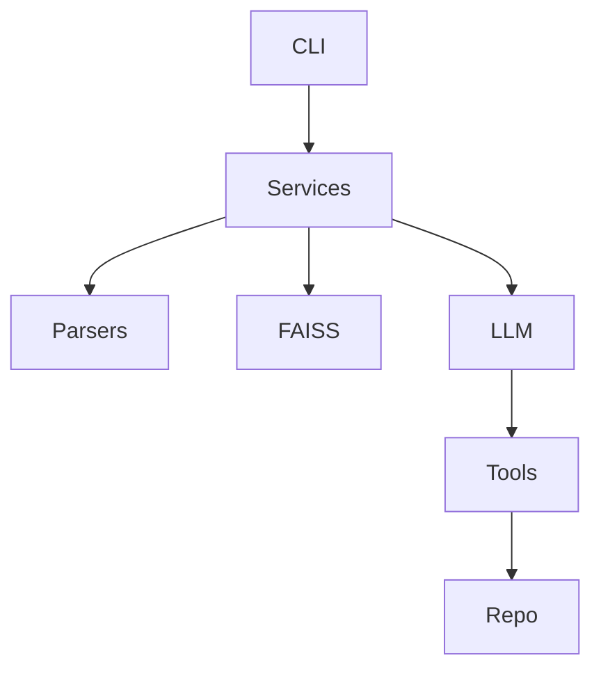

# mana-analyzer

**AI-powered, installable Python CLI for unified codebase analysis and agent-driven automation**

---

## Overview

`mana-analyzer` is a **tool-aware, LLM-augmented code analysis framework** designed to understand, analyze, and interact with real-world software repositories through one primary `analyze` workflow.

It combines:
- static analysis,
- semantic indexing (RAG),
- dependency & structure detection,
- security checks,
- and *agent-based reasoning* (including a coding agent that can read, search, patch, and verify code).

The system is optimized for **large, multi-language repositories** and is safe-by-default: agents must inspect files before modifying them, all edits go through patch tools, and every step is logged.

---

## What Problems It Solves

- 🔍 *"Where is this logic implemented?"* → `analyze --query` semantic search with line-level citations
- 🧠 *"Explain this repository"* → unified architecture, technology, structure, dependency, and security report
- 🛠️ *"Fix this bug"* → coding agent that reads code, plans, patches, and verifies
- 🔐 *"Is this project secure?"* → dependency + vulnerability scanning
- 📊 *"Show dependencies"* → analyze artifacts with JSON / DOT / GraphML dependency graphs
- 🤖 *"Let the agent work"* → tool-aware chat with multi-step execution

---

## Key Features

- ✅ **Unified analysis** – indexing, search, findings, describe, deps, graph, report, and flow in one command
- ✅ **Incremental indexing** – only changed files are re-embedded
- 🌍 **Multi-language parsing** – Python, JS/TS, Go, Rust, JVM, C/C++, Bash, Markdown, etc.
- 📐 **Static analysis** – complexity, unused imports, docstrings, nesting, patterns
- 🔎 **Semantic search** – FAISS-backed vector similarity search via `analyze --query`
- 🧠 **RAG Q&A (`ask`)** – grounded answers with file + line references
- 🧩 **Architecture & technology detection** – frameworks, languages, layout
- 🔗 **Dependency graphs** – JSON, DOT, GraphML emitted by `analyze`
- 🧪 **Security scans** – `pip list --outdated`, `safety` (optional)
- 💬 **Interactive chat** – tool-aware, stateful REPL
- 🧑‍💻 **Coding agent** – plans → reads → edits → verifies
- 🧰 **Pluggable architecture** – LLMs, vector stores, parsers, tools

---

## Repository Structure

```
src/
└─ mana_analyzer/
   ├─ commands/        # Typer CLI entry points
   ├─ analysis/        # Static analysis & chunking
   ├─ parsers/         # Language-specific parsers
   ├─ services/        # Core services (index, ask, analyze, report, ...)
   ├─ llm/             # LLM agents, prompts, tool workers
   ├─ tools/           # Tool definitions (search, patch, filesystem)
   ├─ vector_store/    # FAISS abstraction
   ├─ utils/           # Logging, discovery, helpers
   └─ config/          # Settings & env handling

tests/                # Pytest suite + fixtures
```

## Project Structure Analysis

A detailed generated analysis is available in:

- `docs/project_structure_analysis.md`
- `docs/project_structure_analysis.json`

---

## Installation

### Requirements

- Python **3.10+**
- An OpenAI-compatible API key (OpenAI, Azure, or self-hosted)

### Install

```bash
python3 -m venv .venv
source .venv/bin/activate

pip install --upgrade pip
pip install -e .[dev]
```

Optional extras:

- `dev` – testing, linting
- `security` – vulnerability scanning
- `faiss-gpu` – GPU FAISS (CUDA required)

---

## Environment Variables

```bash
export OPENAI_API_KEY="sk-..."
export OPENAI_BASE_URL="https://api.openai.com/v1"   # optional
```

All settings can also be defined via `.env` or `settings.toml`.

---

## Quick Start

```bash
# Run the unified LLM analysis pipeline
mana-analyzer analyze /path/to/project

# Include semantic search results in the same report
mana-analyzer analyze /path/to/project --query "authentication flow"

# Machine-readable output
mana-analyzer analyze /path/to/project --json

# Ask an indexed question (interactive Q&A remains separate)
mana-analyzer ask "How is configuration loaded?"

# Start interactive agent chat
mana-analyzer chat
```

---

## CLI Commands

| Command | Purpose |
|-------|--------|
| `ask` | RAG-based Q&A |
| `analyze` | Unified index, optional search, static + LLM findings, describe, deps, graph, security, flow, and report artifacts |
| `chat` | Interactive agent session |

`analyze` writes:

- `<project>/.mana/analyze.json`
- `<project>/.mana/analyze.md`
- `<project>/.mana/analyze.html`
- `<project>/.mana/analyze.dot`
- `<project>/.mana/analyze.graphml`

`analyze`, `ask`, and `chat` support `--help`; `analyze` and `ask` support `--json`.
Text mode uses a unified Rich UI output layer; `--json` remains strict machine-readable JSON.
`--verbose` streams debug logs to console (`stderr`) and writes them to `.mana_logs/...`.

---

## Coding Agent (How It Works)

The coding agent follows a **tool-first execution model**:

1. Plan tasks
2. Search repository
3. Read files (required)
4. Apply patches (`apply_patch`)
5. Verify changes
6. Finalize or revise

Safety rules:
- No blind edits
- Unified diff patches only
- Verification before completion

Flow state is persisted at:
```
<project>/.mana/index/chat_memory.sqlite3
```

The active flow snapshot is included in `analyze` output:
```bash
mana-analyzer analyze .
```

---

## Architecture (High Level)



Layers:
- **CLI** – Typer-based interface
- **Services** – business logic
- **LLM** – agents, prompts, planners
- **Tools** – filesystem, search, patch
- **Vector Store** – FAISS

---

## Development

```bash
pip install -e .[dev]
pytest -q
ruff check src tests
mypy src tests
```

---

## Use Cases

- Architecture reviews
- Onboarding new engineers
- Large legacy code understanding
- Automated refactoring
- AI-assisted bug fixing
- CI reporting & documentation

---

## License

MIT License

---

## Status

✅ Actively developed
✅ Production-ready core
✅ Extensible agent system

---

**mana-analyzer** turns codebases into searchable, explainable, and fixable systems.
