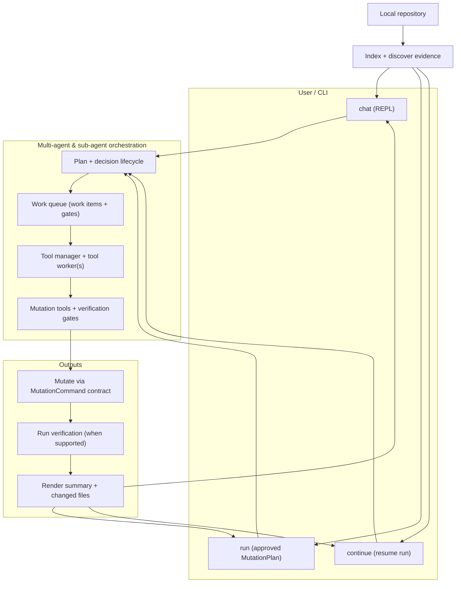

# mana-agent

> Multi-agent-powered repository analysis, evidence-backed Q&A, and tool-aware coding automation for local codebases.

`mana-agent` is an installable Python CLI for understanding and changing software projects. It can index a repository, run static and dependency analysis, generate reports, answer questions with repository context, and drive a constrained coding agent that can inspect files, apply patches, and run verification commands.

Current documented version: **v0.0.9**.

---

## Table of Contents

- [Why mana-agent?](#why-mana-agent)
- [Core Capabilities](#core-capabilities)
- [How It Works](#how-it-works)
- [Requirements](#requirements)
- [Installation](#installation)
- [Configuration](#configuration)
- [Quick Start](#quick-start)
- [CLI Reference](#cli-reference)
- [Generated Artifacts](#generated-artifacts)
- [Coding Agent Safety Model](#coding-agent-safety-model)
- [Project Layout](#project-layout)
- [Documentation](#documentation)
- [Development](#development)
- [License](#license)

---

## Why mana-agent?

Large codebases are hard to inspect, summarize, and safely modify. `mana-agent` is designed to make repository work repeatable and evidence-driven:

- **Analyze** a project into machine-readable and human-readable artifacts.
- **Ask** questions and receive answers grounded in repository search results.
- **Chat** with an interactive assistant that can plan, inspect, patch, and verify code changes.
- **Persist** coding-flow state so multi-turn work can continue across sessions.
- **Control** tool execution through explicit repository tools instead of unrestricted file mutation.

---

## Core Capabilities

### Interactive coding + deterministic mutation execution

`mana-agent` supports two complementary ways to work with a repository:

1. **Interactive REPL workflows** via `mana-agent chat` (Q&A + guided coding-agent loops).
2. **Deterministic, approved mutations** via `mana-agent run --plan-id <id>` (execute an approved plan as a gated mutation/run against a target repository).

The chat workflow supports planning mode, persisted coding memory, optional tool-worker execution paths, and diagram rendering.

The approved mutation workflow separates planning/approval from executing changes, using a typed `MutationCommand` contract.

---

## How It Works



For a standalone diagram, see [docs/07-diagram.md](./docs/07-diagram.md).

---

## Requirements

- Python **3.10 through 3.14**.
- An OpenAI-compatible chat endpoint.
- An OpenAI-compatible embedding endpoint.
- Environment configuration for API keys and model names.

The default dependency set uses CPU FAISS for local vector search. Redis/RQ support is available for optional tool-worker execution paths.

---

## Installation

Create and activate a virtual environment:

```bash
python3 -m venv .venv
source .venv/bin/activate
```

Install the project in editable mode:

```bash
python -m pip install --upgrade pip
python -m pip install -e .
```

For local development and verification, install common test/quality tools:

```bash
python -m pip install pytest ruff mypy
```

Confirm the CLI is available:

```bash
mana-agent --help
```

---

## Configuration

Configure model providers and multi-agent behavior with environment variables or a local `.env` file:

```bash
OPENAI_API_KEY="sk-..."
OPENAI_BASE_URL="https://api.openai.com/v1"
OPENAI_CHAT_MODEL="gpt-4.1"
OPENAI_TOOL_WORKER_MODEL="gpt-4.1"
OPENAI_CODING_PLANNER_MODEL="gpt-4.1"
OPENAI_EMBED_MODEL="text-embedding-3-small"
DEFAULT_TOP_K=8

# Mutation execution (approved plans)
MUTATION_MAX_STEPS=25
MUTATION_VERIFY_ON_CHANGE=1
```

| Variable | Purpose |
| --- | --- |
| `OPENAI_API_KEY` | API key used for chat and embedding requests. |
| `OPENAI_BASE_URL` | Base URL for an OpenAI-compatible provider. |
| `OPENAI_CHAT_MODEL` | Default chat model for analysis and Q&A. |
| `OPENAI_TOOL_WORKER_MODEL` | Model used by optional tool-worker execution paths. |
| `OPENAI_CODING_PLANNER_MODEL` | Model used for coding-agent planning. |
| `OPENAI_EMBED_MODEL` | Embedding model used for semantic indexing. |
| `DEFAULT_TOP_K` | Default number of search results returned by retrieval workflows. |

| Variable | Purpose |
| --- | --- |
| `MUTATION_MAX_STEPS` | Upper bound for tool/mutation work items per approved plan. |
| `MUTATION_VERIFY_ON_CHANGE` | When `1`, run verification gates after applying mutation changes when supported. |

-## Quick Start

Start an interactive coding-agent session:

```bash
mana-agent chat --root-dir /path/to/project
```

You can also run a previously approved mutation plan deterministically:

```bash
mana-agent run --root-dir /path/to/project --plan-id mp_a672168ef9c0
```

---

## Running an approved mutation plan

If you have an approved workflow/mutation plan id (for example: `mp_a672168ef9c0`), you can execute it deterministically against a target repository.

```bash
mana-agent run --root-dir /path/to/project --plan-id mp_a672168ef9c0
```

This runs the approved plan as an isolated, reproducible mutation/run (separating planning/approval from applying changes).

### MutationCommand (executable)

To execute an approved mutation plan id, `mana-agent run` compiles the plan into an internal, executable `MutationCommand` contract.

> Note: You normally run the plan via `mana-agent run --plan-id ...`. The `MutationCommand(mp_9d694e17a6be)` form below is shown to make the executable contract explicit.

```text
MutationCommand(mp_9d694e17a6be)
```

### Screenshot: full-screen chat panel

<a href="https://ibb.co/zTxbQSR8"></a>

You can see everything in this panel (chat panes, steps/tool activity, and related UI elements) at a glance.

#### Screenshot caption

The panel shows the full chat UI and the tool/activity panes, so you can follow each step while the approved mutation plan executes.


Example:

```bash
mana-agent run --root-dir /path/to/project --plan-id mp_a672168ef9c0
```

Useful global flags:

```bash
mana-agent --output-dir .mana/output chat
```

---

## CLI Reference

| Command | Purpose |
| --- | --- |
| `mana-agent chat` | Open an interactive assistant session for Q&A and coding workflows. |

All commands support `--help`. Structured `--json` output is available where supported.

### `chat`

Starts an interactive REPL for repository Q&A and coding-agent tasks.

Common options:

- `--root-dir` — project root for tools and coding memory.
- `--flow-id` — resume or pin a coding flow.
- `--planning-mode` — ask planning questions before execution.
- `--auto-execute-plan` — execute generated plans.
- `--full-auto` — continue auto-execution until completion or a limit.
- `--coding-memory` / `--no-coding-memory` — enable or disable persisted coding-flow state.
- `--tool-worker-process` — run tools through the worker process path.
- `--multiline-input` — allow multiline REPL input.
- `--diagram-render-images` — render Mermaid diagrams to image artifacts.

Example:

```bash
mana-agent chat --root-dir . --planning-mode --coding-memory
```

Coding memory is stored under the analyzed project at:

```text
<project>/.mana/index/chat_memory.sqlite3
```

#### In-chat `/analyze`

Inside the chat session, run `/analyze` to analyze the current project and
generate report artifacts under `.mana/`. With no arguments it opens a format
menu:

```text
/analyze

Select output format:

1. JSON
2. Markdown
3. HTML
4. DOT graph
5. GraphML
6. Mermaid diagram
7. All formats

Enter choice:
```

Direct forms skip the menu:

```bash
/analyze all
/analyze json markdown html
/analyze --format json,markdown,html
```

`md` is an alias of `markdown`, `mermaid` writes `.mana/diagram.mmd`, and `all`
generates every format. `/analyze` is read-only apart from the `.mana/`
artifacts and runs before normal chat messages reach the model.

---

## Generated Artifacts

By default, analysis artifacts are written under the analyzed project’s `.mana/` directory. Depending on the requested output formats, generated files can include:

```text
.mana/analyze.json
.mana/analyze.md
.mana/analyze.html
.mana/analyze.dot
.mana/analyze.graphml
.mana/diagram.mmd
```

These outputs are intended for automation, documentation, and inspection:

- **JSON** for scripts and CI.
- **Markdown** for reviewable summaries.
- **HTML** for navigable reports.
- **DOT/GraphML** for graph visualization workflows.
- **Mermaid** (`diagram.mmd`) for embeddable architecture diagrams.

---

## Coding Agent Safety Model

The coding agent is built around explicit, traceable tool use:

1. Understand the request and active flow context.
2. Plan concrete steps before editing.
3. Search the repository with text and semantic tools.
4. Read target files before changing them.
5. Patch or write files through constrained repository tools.
6. Run relevant verification where possible.
7. Revise after failed checks when the agent can continue safely.
8. Finalize with changed files, checks, skipped checks, and warnings.

Available repository tools include semantic search, text search, file listing, symbol lookup, file reads, chunk reads, patch application, file writes, command execution, verification, git status/diff, and tool-contract inspection.

---

## Project Layout

```text
src/mana_agent/
  analysis/       Static analysis and chunking
  commands/      CLI commands, chat input, and output rendering
  config/        Settings and environment handling
  dependencies/  Dependency graph support
  describe/      Repository description service
  multi_agent/runtime/            Work queue + decision lifecycle, tool managers/workers, and execution traces
  parsers/       Python and multi-language parser entry points
  renderers/     HTML report rendering
  services/      Index, ask, analyze, report, structure, and security services
  tools/         Agent tools for repository access and mutation
  utils/         Discovery, IO, logging, guards, and tool-run helpers
  vector_store/  FAISS vector-store wrapper

tests/            Pytest suite
docs/             User and developer documentation
.github/          CI workflow configuration
```

---

## Documentation

Additional documentation is available in [`docs/`](./docs/):

| Doc | Description |
| --- | --- |
| [Overview](./docs/01-overview.md) | Project goals and high-level behavior. |
| [Installation](./docs/02-installation.md) | Setup and installation details. |
| [Quick Start](./docs/03-quick-start.md) | First commands to run. |
| [Commands](./docs/04-commands.md) | CLI command reference. |
| [Configuration](./docs/05-configuration.md) | Environment and settings guidance. |
| [Workflows](./docs/06-workflows.md) | Common analysis and coding workflows. |
| [Project Diagram](./docs/07-diagram.md) | Mermaid project diagram. |
| [Architecture](./docs/08-architecture.md) | Internal architecture overview. |
| [Agent Behavior](./docs/09-agent-behavior.md) | How the agent plans and acts. |
| [Error Handling](./docs/10-error-handling.md) | Failure modes and recovery behavior. |
| [Logging](./docs/11-logging.md) | Logging behavior and options. |
| [Testing](./docs/12-testing.md) | Test strategy and commands. |
| [Tool System](./docs/13-tool-system.md) | Repository tool contracts and execution. |
| [Release](./docs/14-release.md) | Release process notes. |
| [Development](./docs/15-development.md) | Development workflow. |
| [Analyze Notes](./docs/analyze.md) | Additional analysis documentation. |

---

## Development

Run the test suite:

```bash
pytest -q
```

Run local quality checks:

```bash
ruff check src tests
mypy src tests
python -c "import mana_agent; print('ok')"
mana-agent --help
mana-agent chat --help
```

The repository includes a GitHub Actions workflow that installs the package on Python 3.12 and runs the pytest suite.

---

## License

MIT License.
