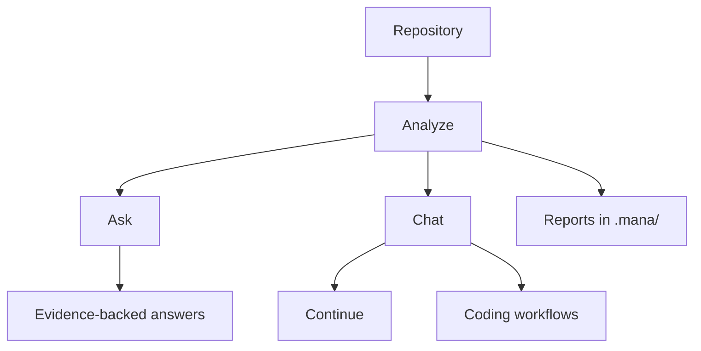

# mana-agent (v0.0.5)

LLM-powered repository analysis and coding-agent automation for local codebases.

`mana-agent` is an installable Python CLI that indexes a project, runs static
and dependency analysis, builds reports, answers questions with repository
context, and runs a tool-aware coding agent that can inspect, patch, and verify
code.

## Docs
- [Overview](./docs/01-overview.md)
- [Installation](./docs/02-installation.md)
- [Quick Start](./docs/03-quick-start.md)
- [Commands](./docs/04-commands.md)
- [Configuration](./docs/05-configuration.md)
- [Workflows](./docs/06-workflows.md)
- [Project Diagram](./docs/07-diagram.md)
- [Architecture](./docs/08-architecture.md)\n- [Project Diagram](./docs/07-diagram.md)

## Project Diagram



See the dedicated diagram doc for a standalone version: [Project Diagram](./docs/07-diagram.md).

## What It Does

- Builds an incremental semantic index for source files.
- Runs static checks, structure analysis, dependency detection, and security
  scanning.
- Produces JSON, Markdown, HTML, DOT, and GraphML analysis artifacts.
- Answers repository questions with search-backed context.
- Provides an interactive chat mode with coding-agent workflows.
- Persists coding-flow state under the analyzed project so work can continue
  across turns.

## Requirements

- Python 3.10 through 3.14
- An OpenAI-compatible chat and embedding endpoint
- `OPENAI_API_KEY` and model settings in the environment or `.env`

The default dependency set uses CPU FAISS. Redis/RQ support is included for
optional tool-worker execution paths.

## Installation

```bash
python3 -m venv .venv
source .venv/bin/activate
python -m pip install --upgrade pip
python -m pip install -e .
```

For local development, install the package plus the tools used by the test and
quality-check commands:

```bash
python -m pip install -e .
python -m pip install pytest ruff mypy
```

## Configuration

Create a `.env` file or export settings in your shell:

```bash
OPENAI_API_KEY="sk-..."
OPENAI_BASE_URL="https://api.openai.com/v1"
OPENAI_CHAT_MODEL="gpt-4.1"
OPENAI_TOOL_WORKER_MODEL="gpt-4.1"
OPENAI_CODING_PLANNER_MODEL="gpt-4.1"
OPENAI_EMBED_MODEL="text-embedding-3-small"
DEFAULT_TOP_K=8
```

See [.env.example](./.env.example) for the local template used by this repo.

## Quick Start

Analyze a repository and write artifacts into its `.mana/` directory:

```bash
mana-agent analyze /path/to/project
```

Include semantic search results in the same report:

```bash
mana-agent analyze /path/to/project --query "authentication flow"
```

Emit strict machine-readable output:

```bash
mana-agent analyze /path/to/project --json
```

Ask a repository question:

```bash
mana-agent ask "How is configuration loaded?" --root-dir /path/to/project
```

Start the interactive coding-agent chat:

```bash
mana-agent chat --root-dir /path/to/project
```

Useful global flags:

```bash
mana-agent --verbose analyze .
mana-agent --log-dir .mana/logs ask "summarize the parser"
mana-agent --output-dir .mana/output chat
```

## CLI Commands

| Command | Purpose |
| --- | --- |
| `analyze` | Runs the unified repository analysis pipeline. |
| `ask` | Answers a question using indexed/search-backed repository context. |
| `chat` | Opens an interactive agent session with optional coding workflows. |

All commands support `--help`. `analyze`, `ask`, and `chat` support `--json`
where structured output is available.

### `analyze`

`analyze` indexes the target project, runs static and LLM-assisted findings,
builds structure/dependency/security summaries, and writes report artifacts.

Common options:

- `--query`: include semantic search results in the report.
- `--k`: control the number of search hits.
- `--model`: override the configured chat model.
- `--no-include-tests`: exclude tests from structure analysis.
- `--offline`: skip online security lookups.
- `--output-format`: choose generated artifact formats.
- `--fail-on`: make the command fail for selected finding levels.
- `--json`: emit JSON to stdout.

Generated artifacts are written under the analyzed project:

```text
.mana/analyze.json
.mana/analyze.md
.mana/analyze.html
.mana/analyze.dot
.mana/analyze.graphml
```

### `ask`

`ask` answers one question from repository context. It can use a provided index,
discover indexes in directory mode, or create a temporary index when enabled.

Common options:

- `--root-dir`: project root for tool execution and default index discovery.
- `--index-dir`: explicit index directory.
- `--dir-mode`: discover multiple project indexes.
- `--auto-index-missing`: index missing projects when possible.
- `--agent-tools/--no-agent-tools`: enable or disable agent tool use.
- `--agent-max-steps`: cap tool-use steps.
- `--json`: emit structured response data.

### `chat`

`chat` opens an interactive REPL for repository Q&A and coding-agent tasks.
It supports planning mode, auto-execution, persisted coding memory, optional
tool-worker execution, and diagram rendering.

Common options:

- `--root-dir`: project root for tools and coding memory.
- `--flow-id`: resume or pin a coding flow.
- `--planning-mode`: ask planning questions before execution.
- `--auto-execute-plan`: execute generated plans.
- `--full-auto`: keep resuming auto-execution until completion or a limit.
- `--coding-memory/--no-coding-memory`: persist coding-flow state.
- `--tool-worker-process`: run tools through the worker process path.
- `--multiline-input`: allow multiline REPL input.
- `--diagram-render-images`: render Mermaid diagrams to image artifacts.

Coding memory is stored at:

```text
<project>/.mana/index/chat_memory.sqlite3
```

## Coding Agent Safety Model

The coding agent is designed around explicit tool use and traceable state:

1. Understand the request and active flow context.
2. Plan concrete steps.
3. Search the repository with text and semantic tools.
4. Read target files before editing them.
5. Patch files through constrained patch/write tools.
6. Run relevant verification where possible.
7. Revise after failed checks when the agent can make progress.
8. Finalize with changed files, checks, skipped checks, and warnings.

Repository tools include semantic search, text search, file listing, symbol
lookup, file reads, chunk reads, patch application, file writes, command
execution, verification, git status/diff, and tool-contract inspection.

## Project Layout

```text
src/mana_agent/
  analysis/       Static analysis and chunking
  commands/       Typer CLI commands and output rendering
  config/         Settings and environment handling
  dependencies/   Dependency graph support
  describe/       Repository description and deep-flow helpers
  llm/            Chains, agents, prompts, tool managers, workers
  parsers/        Python and multi-language parser entry points
  renderers/      HTML report rendering
  services/       Index, ask, analyze, report, structure, security services
  tools/          Agent tools for repository access and mutation
  utils/          Discovery, IO, logging, guards, tool-run helpers
  vector_store/   FAISS vector-store wrapper

tests/            Pytest suite
docs/             Additional workflow and troubleshooting docs
```

## Development

Run the test suite:

```bash
pytest -q
```

Run local quality checks:

```bash
ruff check src tests
mypy src tests
python -c "import mana_agent; print('ok')"
mana-agent --help
mana-agent analyze --help
mana-agent ask --help
mana-agent chat --help
```

The GitHub Actions workflow currently installs the package on Python 3.12 and
runs `pytest -q`.

## License

MIT License. See [LICENSE](./LICENSE).
