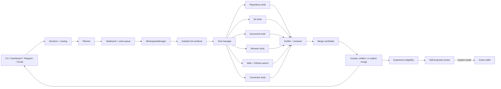

<p align="center">
  
</p>

<h1 align="center">Mana-Agent</h1>

<p align="center">
  <strong>Multi-agent repository intelligence, evidence-backed answers, and safe coding automation.</strong>
</p>

<p align="center">
  <a href="https://www.python.org/"></a>
  <a href="LICENSE"></a>
  
</p>

`mana-agent` is an installable Python CLI and optional web dashboard for understanding, operating, and safely changing software repositories. It combines repository indexing, static analysis, semantic retrieval, multi-agent orchestration, constrained tool execution, Git operations, document processing, browser automation, external search, and remote connectors in one traceable workflow.

> **Current documented version:** `v0.0.17`

## Quick links

- [Installation](#installation)
- [Quick start](#quick-start)
- [Core capabilities](#core-capabilities)
- [CLI reference](#cli-reference)
- [Configuration](#configuration)
- [Telegram connector](#telegram-connector)
- [Web dashboard](#web-dashboard)
- [Documentation](#documentation)
- [Development](#development)

---

## Why Mana-Agent?

Large repositories are difficult to inspect, explain, modify, and verify consistently. Mana-Agent turns repository work into an evidence-driven process:

1. Discover the repository and its available capabilities.
2. Select the smallest relevant evidence set.
3. Read files, symbols, documents, history, or external sources.
4. Plan the requested work.
5. Act through safety-checked tools.
6. Verify the result.
7. Summarize changes, checks, warnings, and remaining risks.

Use Mana-Agent to:

- analyze a local codebase and generate structured reports;
- ask questions grounded in repository evidence;
- plan and perform multi-file coding work;
- inspect and operate Git without unsafe shell interpolation;
- work with Word, PDF, Excel, CSV, and project-library files;
- automate browser tasks in an isolated Playwright session;
- run persistent schedules through local cron or GitHub Actions;
- connect Gmail and Telegram to the same model-driven runtime;
- continue multi-turn coding work with repository-scoped memory.

---

## Core capabilities

| Area | What Mana-Agent provides |
| --- | --- |
| Repository intelligence | Static analysis, dependency discovery, semantic indexing, symbol-aware retrieval, reports, and architecture diagrams. |
| Interactive chat | Repository-grounded Q&A, planning, coding workflows, tool execution, and verification loops. |
| Multi-agent runtime | Decision agent, planner, taskboard, work queue, tool manager, workers, reviewer, verifier, traces, and summaries. |
| Managed worktrees | Isolated Git worktrees per coding task under `~/.mana/repositories/.../worktrees/`, recoverable after restart, reviewed as merge candidates (never silent merges). |
| Safe mutation | Explicit plans, constrained file tools, reviewable patches, command gates, and verification after changes. |
| Git operations | Status, diff, log, branch, switch, commit, push, pull, fetch, merge, rebase, reset, clean, and generic Git help through one policy layer. |
| Adaptive skills | Repository-specific procedures stored outside the checkout, reviewed before activation, and loaded only when selected. |
| Experience-to-Skill Workshop | Verified task experience becomes redacted, evidence-backed proposals that require explicit review before installation. |
| Documents | Detect, read, query, analyze, create, update, and delete supported document formats. |
| Browser automation | Model-selected navigation, clicking, typing, forms, tabs, uploads, downloads, screenshots, and guarded submissions. |
| External search | Optional model-selected web and GitHub search with repository-local result caching. |
| Remote connectors | Gmail access and Telegram bot interaction through the same tool-aware chat runtime. |
| Dashboard | Repository overview, chat, analysis, taskboard, traces, observability, automations, cron jobs, and settings. |
| Automations | Persistent scheduled actions deployed to local cron, GitHub Actions, or both. |
| Artifacts | JSON, Markdown, HTML, DOT, GraphML, Mermaid, traces, and repository-local runtime data. |

---

## Architecture



The model chooses capabilities from tool metadata and active policy. Fixed chat keywords should not silently replace model routing for repository, connector, search, or mutation work.

Every chat turn first passes through the gateway's typed entry router. It selects a registered conversation, coding, connector, search, repository, or automation path from live runtime availability before any response is generated. One session is opened per chat, reused for all turns, and explicitly finalized on exit or `/new`; see [entry routing and chat sessions](docs/21-entry-routing-and-chat-sessions.md).

---

## Requirements

- Python **3.10 through 3.14**
- an OpenAI-compatible chat endpoint;
- an OpenAI-compatible embedding endpoint;
- local access to the repository being analyzed;
- provider credentials stored in Mana-Agent's user configuration;
- optional extras for dashboard, automations, browser, observability, connectors, and document features.

The default dependency set uses CPU FAISS for local vector search. Redis/RQ can be used by optional worker-process execution paths.

---

## Installation

### Install with `pipx`

```bash
pipx install git+https://github.com/manadevelopment23/mana-agent.git
mana-agent --help
```

### Install from source

```bash
git clone https://github.com/manadevelopment23/mana-agent.git
cd mana-agent

python3 -m venv .venv
source .venv/bin/activate

python -m pip install --upgrade pip
python -m pip install -e .

mana-agent --help
```

### Install optional feature sets

```bash
python -m pip install -e ".[dashboard]"
python -m pip install -e ".[automations]"
python -m pip install -e ".[observability]"
python -m pip install -e ".[full]"
```

Install the managed Chromium runtime before using browser tools:

```bash
python -m playwright install chromium
```

### Latest development binaries

#### Linux x64

```bash
curl -L -o mana-agent \
  https://github.com/manadevelopment23/mana-agent/releases/download/latest-dev/mana-agent-linux-x64
chmod +x mana-agent
sudo mv mana-agent /usr/local/bin/mana-agent
mana-agent --help
```

#### macOS Apple Silicon

```bash
curl -L -o mana-agent \
  https://github.com/manadevelopment23/mana-agent/releases/download/latest-dev/mana-agent-macos-arm64
chmod +x mana-agent
sudo mv mana-agent /usr/local/bin/mana-agent
mana-agent --help
```

#### macOS Intel

```bash
curl -L -o mana-agent \
  https://github.com/manadevelopment23/mana-agent/releases/download/latest-dev/mana-agent-macos-x64
chmod +x mana-agent
sudo mv mana-agent /usr/local/bin/mana-agent
mana-agent --help
```

#### Windows PowerShell

```powershell
Invoke-WebRequest `
  -Uri "https://github.com/manadevelopment23/mana-agent/releases/download/latest-dev/mana-agent-windows-x64.exe" `
  -OutFile "mana-agent.exe"

.\mana-agent.exe --help
```

---

## Configuration

Run the full-screen configuration application from an interactive terminal:

```bash
mana-agent --configure
```

The first bare `mana-agent` launch also opens this configuration TUI when the
minimum inference route is missing, then continues directly into chat after a
successful save. The old startup mode menu no longer exists. Provider,
capability-filtered agent models, the separate embedding model, web search, and
GitHub authentication are configured here. Existing provider credentials can
be left unchanged, replaced, or explicitly removed; masked placeholders are
never saved as credentials.

Mana-managed settings are stored under:

```text
~/.mana/config.toml
~/.mana/secrets.toml
~/.mana/model_cache.json
```

Normal settings belong in `config.toml`; API keys, bot tokens, webhook secrets, and other credentials belong in `secrets.toml`. Writes are atomic and secret files use restrictive permissions where the platform supports them.

Repository `.env` files and shell variables do not replace explicitly selected Mana-Agent credentials. Environment variables may fill missing values for CI without being written back. Textual never starts when stdin or stdout is not a TTY; missing non-interactive configuration produces an actionable `mana-agent --configure` error instead of prompting.

### Model routing and catalogs

Provider model catalogs are normalized into capabilities. Agent-role selectors
show text-generation models only; embedding, image-generation, speech, audio,
and video-only models are excluded. The embedding selector shows only embedding
models. Unknown models are not assumed compatible and remain available only as
an explicit Advanced manual entry. Canonical selections use provider-qualified
IDs such as `openai/gpt-4.1`.

### Model-level routing

Map runtime roles to model levels rather than hardcoding a provider model throughout the application:

```text
MODEL_LEVEL_3_HIGH_REASONING=gpt-4.1
MODEL_LEVEL_2_CODING=gpt-4.1
MODEL_LEVEL_1_FAST_TOOL=gpt-4.1-mini

MANA_MODEL_MAIN=MODEL_LEVEL_3_HIGH_REASONING
MANA_MODEL_HEAD_DECISION=MODEL_LEVEL_3_HIGH_REASONING
MANA_MODEL_PLANNER=MODEL_LEVEL_3_HIGH_REASONING
MANA_MODEL_CODING=MODEL_LEVEL_2_CODING
MANA_MODEL_VERIFIER=MODEL_LEVEL_2_CODING
MANA_MODEL_REVIEWER=MODEL_LEVEL_3_HIGH_REASONING
MANA_MODEL_TOOL=MODEL_LEVEL_1_FAST_TOOL
MANA_MODEL_SUMMARIZER=MODEL_LEVEL_1_FAST_TOOL
```

### Common configuration keys

| Key | Purpose |
| --- | --- |
| `OPENAI_API_KEY` | Chat and embedding provider credential. |
| `OPENAI_BASE_URL` | Base URL for an OpenAI-compatible provider. |
| `OPENAI_CHAT_MODEL` | Default model for chat, analysis, and Q&A. |
| `OPENAI_TOOL_WORKER_MODEL` | Model used by optional tool-worker paths. |
| `OPENAI_CODING_PLANNER_MODEL` | Model used for coding plans. |
| `OPENAI_EMBED_MODEL` | Embedding model for semantic indexing. |
| `DEFAULT_TOP_K` | Default number of retrieval results. |
| `MUTATION_MAX_STEPS` | Maximum work items in an approved mutation run. |
| `MUTATION_VERIFY_ON_CHANGE` | Enables verification after repository changes. |
| `MANA_MODEL_*` | Maps each runtime role to a model level. |
| `MANA_SEARCH_*` | Controls optional web/GitHub search behavior. |
| `MANA_OBSERVABILITY_*` | Controls telemetry retention and OTLP export. |

---

## Quick start

### Start Mana-Agent

```bash
mana-agent --configure
cd /path/to/project
mana-agent
```

Bare `mana-agent` opens the chat TUI for the current directory and focuses the
message input. It shows the active repository, provider, primary model, web
search and GitHub status, plus configuration warnings. There is no startup mode
selector.

### Open repository chat directly

```bash
mana-agent chat --root-dir .
```

`mana-agent chat` is a compatibility alias for the same chat experience. Inside
the chat TUI, `/models` opens model management for providers that are already
configured. It can refresh compatible catalogs, switch the current session, or
save a new default, but it cannot collect credentials. Use
`mana-agent --configure` to add or re-authenticate a provider. Plain terminals
support `/models current`, `/models refresh`, and
`/models set <provider/model>`.

Chat messages remain attached to one durable workspace session for the lifetime
of the conversation. Both the plain CLI and Textual TUI accept `/new` to archive
the current session and start an isolated conversation; `/models`, UI refreshes,
tool calls, and model routing reuse that session. Each new chat process creates a
fresh session and abandons any active session left by an earlier process. Mana
still reuses one automatic repository record and one standalone workspace for
each canonical repository path. A specific stored conversation can be selected
explicitly with `mana-agent chat --session <session-id>`.

### Copying TUI text

Messages, Markdown source, code blocks, logs, errors, and expanded tool output
support direct mouse-drag selection inside the TUI. Press `Ctrl+C` to copy the
selected text. Terminal-native Shift-drag selection remains available where the
terminal supports it; card controls and scrolling continue to use ordinary mouse
events.

### Start a planning and coding session

```bash
mana-agent chat \
  --root-dir . \
  --planning-mode \
  --coding-memory
```

### Analyze the current repository

Inside chat:

```text
/analyze all
```

Or choose formats interactively:

```text
/analyze
```

Supported outputs include JSON, Markdown, HTML, DOT, GraphML, and Mermaid.

### Run an approved mutation plan

```bash
mana-agent run \
  --root-dir /path/to/project \
  --plan-id mp_a672168ef9c0
```

### Work with project documents

```text
summarize docs/report.pdf
analyze docs/specification.docx
find payment terms in the current document library
update budget.xlsx sheet March cell B2 to 1200
create a Word report from the analysis
```

### Inspect Git safely

```bash
mana-agent git -- status
mana-agent git -- diff --stat
mana-agent git -- log --oneline -10
mana-agent git -- branch
```

### Start the dashboard

```bash
pip install "mana-agent[dashboard]"
mana-agent dashboard --root-dir .
```

---

## Features

### Repository analysis

Mana-Agent can inspect a project and produce reusable analysis artifacts for humans, scripts, CI, and downstream agents.

Supported output formats:

- JSON
- Markdown
- HTML
- DOT
- GraphML
- Mermaid

Default artifact locations:

```text
.mana/analyze.json
.mana/analyze.md
.mana/analyze.html
.mana/analyze.dot
.mana/analyze.graphml
.mana/diagram.mmd
```

### Interactive coding assistant

The chat runtime supports:

- repository-grounded answers;
- planning mode;
- coding-flow memory;
- model-selected tool use;
- multi-step patches;
- verification and revision loops;
- Git and document tools;
- external search when repository evidence is insufficient;
- browser automation for website tasks;
- final summaries with changed files, checks, skipped checks, and warnings.

Coding memory is repository-scoped:

```text
<project>/.mana/index/chat_memory.sqlite3
```

### Multi-agent orchestration

The runtime coordinates:

- main decision and routing;
- planning;
- taskboard and work queue;
- tool manager and workers;
- coding and mutation tools;
- verification gates;
- reviewer feedback;
- structured execution traces;
- final response generation.

Agents and workers should receive only the context and permissions required for their assigned task.

### Adaptive repository skills

Verified procedures can be retained as adaptive, repository-specific skills. Generated skills are never written into the repository checkout.

They are stored under:

```text
${MANA_HOME:-~/.mana}/skills/repositories/<repository-id>/
```

Generated procedures begin as candidates and require review before activation.

Useful commands:

```bash
mana-agent skills storage-path
mana-agent skills candidates
mana-agent skills review <id>
mana-agent skills approve <id>
```

Useful chat commands:

```text
/skills
/skills available
/skills selected
/skills explain
/skills disable
/skills enable
/skills review <id>
/skills approve <id>
/skills reject <id> <reason>
```

A selected skill is loaded only after repository identity, status, required tools, permissions, and selection limits are validated.

### Experience-to-Skill Workshop

After a substantial verified task, Mana-Agent can evaluate whether the recorded workflow is reusable. Eligible experience is redacted and converted by the trusted built-in `skill-creator` into a proposal under `~/.mana/skill-proposals/`. It remains inactive until explicit review and installation; malformed or unsafe proposals are kept under `~/.mana/skill-quarantine/` and are never loaded.

```bash
mana-agent skill proposals
mana-agent skill proposal review <proposal-id>
mana-agent skill proposal install <proposal-id>
mana-agent skill proposal edit <proposal-id> --draft-file edited.json
mana-agent skill proposal reject <proposal-id> --reason "too broad"
mana-agent skill proposal quarantine <proposal-id> --reason "unsafe"
mana-agent skill create-from-session <session-id>
```

See [`docs/19-experience-to-skill-workshop.md`](docs/19-experience-to-skill-workshop.md) for eligibility, confidence, storage, configuration, security, versioning, duplicate handling, events, and quarantine recovery.

### Document files

Mana-Agent exposes a document capability family to the decision agent:

```text
document_detect
document_read
document_analyze
document_query
document_create
document_update
document_delete
```

Supported formats:

- `.docx`
- `.pdf`
- `.xlsx`
- `.xlsm`
- `.csv` when readable by the installed document provider

Document safety rules include:

- image-only PDFs are reported as requiring OCR instead of fabricating text;
- formulas are preserved unless replacement is explicitly requested;
- macro-enabled workbooks are opened with preservation where supported;
- updates create backups by default and use atomic writes where possible;
- deletion requires explicit intent and remains constrained to the project root.

### Browser automation

An optional Playwright-based browser lets the model complete website tasks through explicit tools for:

- navigation;
- page inspection;
- clicking and typing;
- forms and keyboard actions;
- tabs and windows;
- file upload and download;
- screenshots;
- guarded submission of sensitive actions.

Browser actions run in an isolated session and remain subject to permission, domain, secret-handling, and destructive-action policies.

See [`docs/17-browser-automation.md`](docs/17-browser-automation.md).

### Email connector

The Gmail connector allows authenticated mailbox search, message reading, thread inspection, attachment access, drafts, replies, forwarding, labels, archive, and Trash operations through explicit tools and user intent.

See [`docs/16-email-connectors.md`](docs/16-email-connectors.md).

### Telegram connector

The Telegram connector exposes Mana-Agent as a remote chat surface while keeping repository tools, permissions, traces, and safety rules in the main runtime.

Recommended transport policy:

- **Long polling** for local development, private servers, and the simplest deployment.
- **Webhook** for public production services that already provide HTTPS ingress and reliable process supervision.

Only one transport may receive updates for a bot at a time. The connector should validate user/chat allowlists before invoking the model, store offsets or update IDs to avoid duplicate work, split oversized replies safely, and never expose the bot token in logs.

Start with:

```bash
mana-agent connector telegram --help
```

Canonical lifecycle:

```bash
mana-agent connector telegram configure
mana-agent connector telegram status
mana-agent connector telegram run --mode polling
```

Webhook deployment:

```bash
mana-agent connector telegram webhook set \
  --url https://agent.example.com/connectors/telegram/webhook

mana-agent connector telegram webhook info
mana-agent connector telegram webhook delete
```

See the complete setup, configuration, security, deployment, and troubleshooting guide in [`docs/17-telegram-connector.md`](docs/17-telegram-connector.md).

### External search

External search is model-driven:

- repository-local evidence remains preferred;
- the model decides whether current web or GitHub information is necessary;
- search should not trigger only because a message contains a fixed keyword;
- reusable results are cached under `.mana/search_memory.jsonl`;
- provider failures remain distinct from repository retrieval failures.

Common variables:

```text
MANA_SEARCH_ENABLE_WEB=1
MANA_SEARCH_ENABLE_GITHUB=1
MANA_SEARCH_MAX_RESULTS=8
MANA_SEARCH_TIMEOUT_SECONDS=30
MANA_SEARCH_MEMORY_TTL_DAYS=7
MANA_GITHUB_TOKEN=ghp_...
MANA_WEB_SEARCH_PROVIDER=<provider>
MANA_WEB_SEARCH_API_KEY=<key>
MANA_WEB_SEARCH_ENDPOINT=<endpoint>
```

### Model-driven Git tools

Git runs through a shared, safety-checked executor rather than chat keyword shortcuts.

Core capabilities include:

```text
git.status       git.diff         git.log          git.show
git.branch       git.switch       git.create_branch
git.add          git.commit       git.push         git.pull
git.fetch        git.remote       git.merge        git.rebase
git.reset        git.clean        git.generic      git.help
```

Safety principles:

- invoke Git with argument arrays and `shell=False`;
- inspect status and diffs before creating a commit;
- stage only relevant files;
- generate commit messages from the staged diff;
- inspect branch, remote, and upstream before push;
- never default to force push;
- require explicit validated intent for destructive or history-rewriting commands.

Direct CLI passthrough uses the same executor and policy:

```bash
mana-agent git -- status
mana-agent git -- help -a
mana-agent git -- branch
mana-agent git -- diff
mana-agent git -- push -u origin feature/example
```

Protected commands require explicit permission:

```bash
mana-agent git --allow-protected -- clean -fd
```

### Approved mutation plans

Planning and mutation execution can be separated:

```bash
mana-agent run \
  --root-dir /path/to/project \
  --plan-id mp_f8864a662ad5
```

The approved plan is compiled into an internal executable contract such as:

```text
MutationCommand(mp_f8864a662ad5)
```

The contract is executed only through registered repository mutation tools and active permission gates.

### Codex-owned coding turns

CLI, TUI, and dashboard coding routes use the same Codex app-server shim. A
single Codex turn owns repository inspection, the coding plan, implementation,
review, and task-specific verification. Mana-Agent supplies an isolated
worktree for writes and retains permission, event, result, and merge controls.
It does not run the legacy coding planner before Codex or fall back to that
planner when Codex fails. Underspecified edit requests must be clarified instead
of producing an arbitrary repository change.

---

## Web dashboard

Install and run:

```bash
pip install "mana-agent[dashboard]"
mana-agent dashboard --root-dir .
```

Dashboard pages include:

| Page | Purpose |
| --- | --- |
| Overview | Repository status, index health, recent activity, and quick actions. |
| Chat | Repository-grounded questions and coding-agent workflows. |
| Analysis | Run analysis and inspect reports and diagrams. |
| Taskboard | Active and completed tasks, agents, workers, and state. |
| Traces | Decisions, tool calls, verification results, and runtime events. |
| Observability | Trace trees, timings, token usage, latency, errors, queue waits, and bottleneck findings. |
| Automations | Create and manage persistent scheduled actions. |
| Cron Jobs | Inspect deployment state and enable, disable, or remove schedules. |
| Settings | Provider, model-role, search, connector, and runtime settings. |

For dashboard development:

```bash
streamlit run dashboard/app.py -- --root-dir .
```

Dashboard operations use the same validation and safety rules as the CLI. Page navigation alone never authorizes destructive actions.

### Observability and OTLP export

Repository telemetry is stored under:

```text
~/.mana/repositories/<repository_id>/observability/telemetry.sqlite
```

Payloads are bounded and common credentials are redacted. Default retention is 30 days and 500 MB.

```text
MANA_OBSERVABILITY_RETENTION_DAYS=30
MANA_OBSERVABILITY_MAX_STORAGE_MB=500
MANA_OBSERVABILITY_OTLP_ENDPOINT=<endpoint>
MANA_OBSERVABILITY_OTLP_HEADERS='{"Authorization":"Bearer ..."}'
```

Install optional OpenTelemetry support with:

```bash
pip install "mana-agent[observability]"
```

Local telemetry remains authoritative when an export fails.

---

## Automations and cron jobs

Schedules are stored in:

```text
.mana/automations/config.json
```

A schedule can target:

- local cron;
- GitHub Actions;
- both targets from one Mana-Agent schedule.

Install dependencies:

```bash
pip install "mana-agent[automations]"
```

Create and deploy a schedule:

```bash
mana-agent automation create \
  --name "Nightly analysis" \
  --action analyze \
  --cron "0 2 * * *" \
  --target local \
  --target github \
  --deploy
```

Lifecycle commands:

```bash
mana-agent automation list
mana-agent automation show sch_<id>
mana-agent automation status sch_<id>
mana-agent automation deploy sch_<id>
mana-agent automation run sch_<id>
mana-agent automation enable sch_<id>
mana-agent automation disable sch_<id>
mana-agent automation remove sch_<id>
```

Local cron uses the host timezone. GitHub Actions schedules use UTC.

For GitHub targets, Mana-Agent generates one managed workflow per schedule. The workflow installs the required package extras, executes the action, uploads `.mana/` as workflow artifacts, and exposes manual dispatch.

When deployment requires repository changes, Mana-Agent must show planned file and Git operations before commit or push and must not silently modify the default branch.

---

## CLI reference

All commands support:

```bash
--help
```

Structured `--json` output is available where supported.

### Chat

```bash
mana-agent chat --root-dir .
```

Common options:

| Option | Purpose |
| --- | --- |
| `--root-dir` | Repository root for tools and coding memory. |
| `--flow-id` | Resume or pin a coding flow. |
| `--planning-mode` | Enable planning-oriented interaction. |
| `--auto-execute-plan` | Execute generated plans when policy permits. |
| `--full-auto` | Continue execution until completion or a safety limit. |
| `--coding-memory` | Enable persisted coding-flow state. |
| `--no-coding-memory` | Disable persisted coding-flow state. |
| `--tool-worker-process` | Execute tools through the worker-process path. |
| `--multiline-input` | Enable multiline terminal input. |
| `--diagram-render-images` | Render Mermaid diagrams to image artifacts. |

### In-chat analysis

```text
/analyze
/analyze all
/analyze json markdown html
/analyze --format json,markdown,html
```

Notes:

- `md` is an alias for `markdown`;
- `mermaid` writes `.mana/diagram.mmd`;
- `all` generates every supported format;
- analysis is read-only except for generated `.mana/` artifacts.

### Approved plan execution

```bash
mana-agent run --root-dir . --plan-id mp_<id>
```

### Git

```bash
mana-agent git -- status
mana-agent git -- diff
mana-agent git -- branch
mana-agent git -- help -a
```

### Dashboard

```bash
mana-agent dashboard --root-dir . --host 127.0.0.1 --port 8501
```

### Automations

```bash
mana-agent automation --help
```

### Connectors

```bash
mana-agent connector email --help
mana-agent connector telegram --help
```

---

## Safety model

Mana-Agent is built around explicit, traceable tool use.

Typical mutation flow:

1. understand the request and active flow;
2. inspect repository state;
3. search and read relevant evidence;
4. create concrete work items;
5. apply a small, reviewable patch;
6. run focused verification;
7. revise safely when checks fail;
8. report changed files, checks, skipped checks, warnings, and remaining risk.

Core principles:

- inspect before editing;
- preserve user changes;
- avoid unrelated rewrites;
- keep changes minimal and reviewable;
- constrain file operations to the active repository;
- do not leak credentials into prompts, logs, traces, commits, or remote replies;
- require explicit intent for destructive operations;
- keep connector authorization separate from model reasoning;
- distinguish verification failure from tool, provider, permission, and transport failure.

---

## Project layout

```text
src/mana_agent/
  analysis/       Static analysis and chunking
  automations/    Scheduler and deployment integration
  commands/       CLI commands, chat input, and rendering
  config/         User settings, secrets, and model configuration
  connectors/     Email, Telegram, and external service adapters
  dependencies/   Dependency graph support
  describe/       Repository description services
  multi_agent/    Decisions, agents, taskboard, queues, tools, traces
  parsers/        Language and document parser entry points
  renderers/      Report and diagram rendering
  services/       Analyze, ask, index, report, security, and workflows
  tools/          Repository, Git, document, browser, and connector tools
  ui/             Banner and dashboard helpers
  utils/          Discovery, IO, logging, guards, and execution helpers
  vector_store/   FAISS vector-store wrapper

dashboard/        Optional Streamlit dashboard
automations/      Workflow templates and scheduler resources
tests/            Pytest suite
docs/             User and developer documentation
.github/          CI and release workflows
```

Optional packages are lazy-loaded. Install only the extras required by the active deployment.

---

## Documentation

| Document | Description |
| --- | --- |
| [`docs/01-overview.md`](docs/01-overview.md) | Project goals and high-level behavior. |
| [`docs/02-installation.md`](docs/02-installation.md) | Installation and setup. |
| [`docs/03-quick-start.md`](docs/03-quick-start.md) | First commands and workflows. |
| [`docs/04-commands.md`](docs/04-commands.md) | CLI command reference. |
| [`docs/19-experience-to-skill-workshop.md`](docs/19-experience-to-skill-workshop.md) | Verified experience, proposal review, installation, and quarantine. |
| [`docs/21-entry-routing-and-chat-sessions.md`](docs/21-entry-routing-and-chat-sessions.md) | Typed entry routing, connector availability, and chat-session lifecycle. |
| [`docs/05-configuration.md`](docs/05-configuration.md) | Provider, model, search, and runtime settings. |
| [`docs/06-workflows.md`](docs/06-workflows.md) | Common analysis and coding workflows. |
| [`docs/07-diagram.md`](docs/07-diagram.md) | Standalone Mermaid architecture diagram. |
| [`docs/08-architecture.md`](docs/08-architecture.md) | Internal architecture. |
| [`docs/09-agent-behavior.md`](docs/09-agent-behavior.md) | Agent planning and action rules. |
| [`docs/09-mcp.md`](docs/09-mcp.md) | MCP tooling, configuration, and interoperability. |
| [`docs/10-error-handling.md`](docs/10-error-handling.md) | Failure classification and recovery. |
| [`docs/11-logging.md`](docs/11-logging.md) | Logging, redaction, and verbosity. |
| [`docs/12-testing.md`](docs/12-testing.md) | Test strategy and commands. |
| [`docs/13-tool-system.md`](docs/13-tool-system.md) | Tool contracts and execution. |
| [`docs/14-release.md`](docs/14-release.md) | Release process. |
| [`docs/15-development.md`](docs/15-development.md) | Development workflow. |
| [`docs/16-email-connectors.md`](docs/16-email-connectors.md) | Gmail connector setup and security. |
| [`docs/17-browser-automation.md`](docs/17-browser-automation.md) | Browser automation setup and safety. |
| [`docs/18-telegram-connector.md`](docs/18-telegram-connector.md) | Telegram bot setup, polling/webhook deployment, security, and troubleshooting. |
| [`docs/adaptive-coding-runtime.md`](docs/adaptive-coding-runtime.md) | Adaptive coding runtime overview and behavior. |
| [`docs/multi-agent-routing.md`](docs/multi-agent-routing.md) | Multi-agent routing architecture and decision flow. |

---

## Development

Install development dependencies:

```bash
python -m pip install -e ".[full]"
python -m pip install pytest ruff mypy
```

Run tests:

```bash
pytest -q
```

Run quality checks:

```bash
ruff check src tests
mypy src tests
python -c "import mana_agent; print('ok')"
mana-agent --help
mana-agent chat --help
```

Recommended pre-commit review:

```bash
git status
git diff --stat
git diff
pytest -q
ruff check src tests
```

Update `CHANGELOG.md` for repository changes and record the verification that was run.

---

## License

Mana-Agent is released under the [MIT License](LICENSE).
