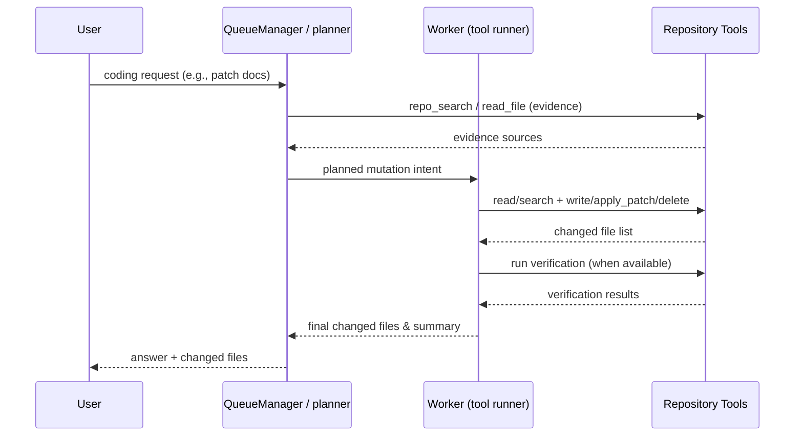

# Project Diagram

This page contains a few Mermaid diagrams that summarize how `mana-agent`
coordinates analysis, retrieval, and coding workflows.

## High-level flow

```mermaid
flowchart TD
    A[Local repository] --> B[Discover & index files]
    B --> C[Analyze]
    C --> D[Generate artifacts under .mana/]
    B --> E[Ask (search + evidence)]
    E --> F[LLM answers grounded in evidence]
    B --> G[Chat (REPL)]
    G --> H[Plan]
    H --> I[Inspect files & retrieve evidence]
    I --> J[Patch / write files through tools]
    J --> K[Run verification]
    K --> L[Summarize changes]
```

## Artifact outputs

```mermaid
flowchart LR
    A[Requested format(s)] --> B[analyze.json]
    A --> C[analyze.md]
    A --> D[analyze.html]
    A --> E[analyze.dot / graphml]
    A --> F[diagram.mmd]
    B --> G[Automation & CI]
    C --> H[Human review]
    D --> I[Browseable report]
    E --> J[Graph visualization]
    F --> K[Embeddable diagram]
```

## Coding-agent tool lifecycle


