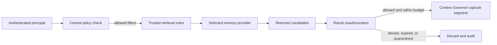
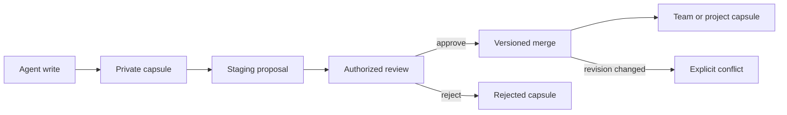

# Scoped shared-memory capsules

Mana-Agent uses versioned, compact memory capsules for task and agent sharing. A capsule is structured data with explicit scope, trusted namespace, owner identities, provenance, trust/review state, expiry, content hash, and revision. Full chat transcripts are not capsule content by default.

## Architecture and security boundary

`MemoryService.capsules` is the only application-facing lifecycle boundary. `CapsuleAuthorizationPolicy` denies access unless the authenticated principal has the required capability and its user, task relationship, project, team, organisation, and namespace all match trusted task context. Identifiers supplied in capsule content never select a namespace or grant a capability.



Provider search is an availability and ranking mechanism, never a security boundary. Mana retains scope, owner, revision, hash, review, and lineage metadata locally for both internal and external memory modes. If trusted metadata is absent or invalid, the record is not returned. External-provider content retains provider/origin attribution.

Capsule content enters model context as a `memory` segment labeled untrusted data. It cannot become system or developer instructions and cannot grant itself capabilities. Credential requests, policy overrides, permission escalation, and prompt-injection patterns quarantine the capsule and emit a redacted audit event.

## Scopes and capabilities

The initial scopes are `private`, `parent_child`, `team`, `project`, `organisation`, and `user`.

- `private` requires an exact creating task or agent and matching user.
- `parent_child` requires a direct durable task relationship and explicit delegation or return.
- `team` requires membership and a team read/merge capability.
- `project` requires the same trusted repository/project and a project capability.
- `organisation` is disabled by default.
- `user` requires the same authenticated user and existing user-memory consent/configuration.

Reads use `memory.capsule.read.<scope>`. Direct writes are limited to `memory.capsule.write.private`, `memory.capsule.write.parent_child`, and the consent-gated user capability. Team/project proposals use `memory.capsule.stage.*`; reviewers need `memory.capsule.review` plus `memory.capsule.merge.*`. Deletion requires `memory.capsule.delete` in addition to ordinary read authorization.

## Delegation and execution lifecycle

When a child is created, the parent supplies explicit capsule IDs. Mana reauthorizes each source, copies only compact projections into `parent_child` capsules, and records the delegated IDs/revisions on the TaskBoard and resilient supervisor record. Checkpoints and result escrow preserve revision maps across cancellation, retry, resume, and restart. The child has no ambient parent-history query.

On completion, callers create a private result and a parent-child return capsule, then pass those revisions with the supervised result. A successful task does not promote shared knowledge. Team/project proposals remain staged until review.

Follow-up classification occurs before task-private recall. A completed task remains immutable; a correction, expansion, or new request creates a new durable task and may receive only the model-selected related task's authorized capsule projections. Conversation-wide legacy recall is used only when the capsule feature flag is disabled.

## Review, merge, and lineage



Supported decisions are `append`, `replace`, `patch`, `supersede`, and `reject`. Merges use expected target revisions and content hashes. A stale target creates a conflict record without changing the target. A stable request ID makes retries idempotent. Conflict resolution requires a fresh explicit strategy and revision. Lineage exposes capsule IDs, ancestors/descendants, merge records, consumers, supersession, and reviewer identity without exposing source bodies.

## Persistence, migration, and retention

Trusted capsule state is stored atomically under the repository's existing Mana state directory. Redacted structured audit events are written to `~/.mana/logs/memory-capsules.jsonl`; titles, summaries, content, evidence, and credentials are omitted.

Legacy records do not become shared capsules. Controlled migration creates quarantined, unscoped placeholders containing only the legacy record ID and a mapping-required marker. Ownership is never inferred from conversation text. Disabling capsules preserves capsule data and restores the supported legacy provider path, including external provider selection, without copying records between providers.

The direct multi-agent compatibility adapter is capsule-enabled by default and delegates authorized reads to a `CapsuleService`. When it is created by the canonical `MemoryService`, both objects share the same capsule lifecycle service and repository. Broad `ScopedMemoryBundle` construction is available only when a compatibility caller explicitly passes `capsules_enabled=False`; capsule-enabled callers must provide a validated `CapsuleReadRequest`.

Default retention is seven days for private capsules, 30 for parent-child, 90 for team, 180 for project/user, and 365 for the disabled organisation scope. Expired, soft-deleted, rejected, and quarantined capsules are excluded. Redaction replaces content while preserving hash/revision history and lineage; permanent deletion requires explicit authorized intent.

## API and dashboard

The typed `/api/v1/memory/capsules` endpoints query authorized projections, inspect metadata/lineage, list staged proposals, stage, merge/reject, resolve conflicts, and delete/redact. `mana-agent api` binds a fixed local process identity for its startup repository and OS user, so local project/user reads work without accepting identity fields from requests. The dashboard supplies that same identity to its cached chat gateway, allowing the gateway to persist and retrieve task-private capsules only during its model-selected follow-up flow. Private and parent-child task capsules remain unavailable to broad API/dashboard queries. A deployed host should install an authenticated `capsule_identity_resolver` for task-aware access; the API never accepts principal IDs from the request body and returns generic not-found responses for inaccessible IDs.

Dashboard → Memory Capsules calls the same API and never reads provider files directly. Authorized reviewers can inspect, approve/merge, or reject staged proposals there. `mana-agent memory capsules list|inspect|lineage|staged|review` uses that same authenticated API; list commands require explicit scopes, and no command accepts principal or namespace identity overrides.

## Rollout limitations

Organisation federation, cross-provider synchronization, legal-hold adapters, and administrative governance remain later-phase work. Organisation writes stay disabled. External providers are not trusted to enforce ACLs; Mana's local trusted metadata is authoritative.

## User verification

Run targeted security coverage first:

```bash
python -m pytest tests/memory/test_scoped_capsules.py tests/test_memory_architecture.py
python -m pytest tests/gateway/test_chat_gateway.py tests/gateway/test_followup_classifier.py
python -m pytest tests/execution_supervisor/test_supervisor_core.py tests/context_cost/test_context_cost_core.py
python -m pytest
```

Confirm specifically that missing/invalid identities and capabilities fail closed, external-provider unauthorized records are discarded, staged writes are absent from normal retrieval, revision conflicts do not mutate targets, and no legacy conversation-wide fallback runs while capsules are enabled.
