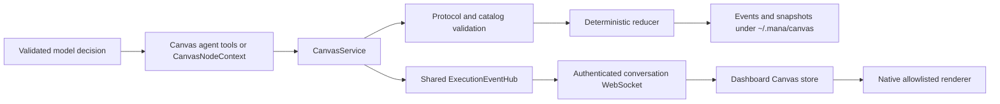
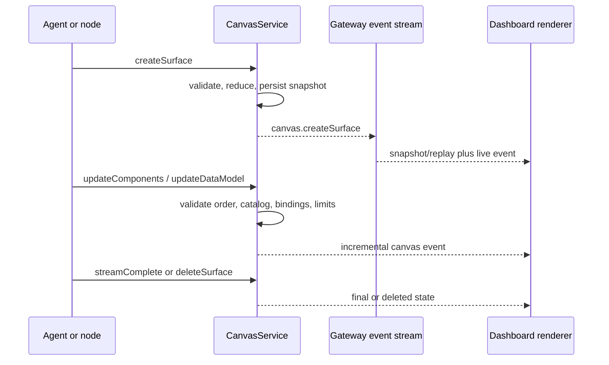
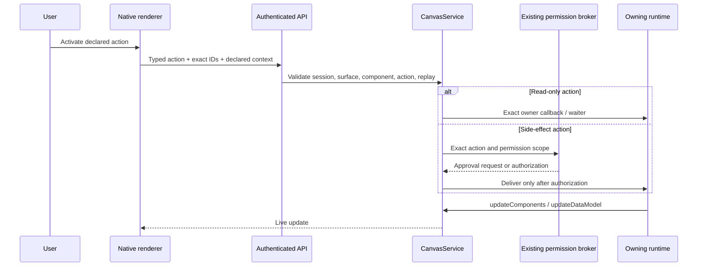

# Live Canvas and A2UI

Live Canvas is Mana-Agent's durable, agent-driven visual workspace. It implements the A2UI v0.9.1 production protocol family (wire version `v0.9`) and a versioned native catalog. It does not execute model-generated HTML, JavaScript, CSS, Python, shell, or framework source.

## Architecture



Canvas does not introduce an event bus or session authority. Surface activity is published as `canvas.*` events through `ExecutionEventHub`, carried by the existing conversation WebSocket, and correlated to the canonical Mana session/conversation. Session deletion removes its Canvas state through the normal `SessionService` path.

## Protocol lifecycle



The strict A2UI payload contains one of `createSurface`, `updateComponents`, `updateDataModel`, or `deleteSurface`, plus `version: "v0.9"`. Mana-specific ownership, correlation, completion, and retention metadata stays in the immutable `CanvasEventEnvelope`, not in the A2UI message.

Example messages:

```json
{"version":"v0.9","createSurface":{"surfaceId":"project-plan","catalogId":"https://mana-agent.dev/a2ui/catalogs/core/v1/catalog.json","sendDataModel":true}}
```

```json
{"version":"v0.9","updateComponents":{"surfaceId":"project-plan","components":[{"id":"root","component":"Column","children":["title"]},{"id":"title","component":"Heading","text":"Project plan","level":2}]}}
```

```json
{"version":"v0.9","updateDataModel":{"surfaceId":"project-plan","path":"/status","value":"running"}}
```

## Action round trip



Visible labels never authorize behavior. The server checks the declared action name on the exact component and surface. Client-supplied permission scopes are rejected by the action schema. Side-effect declarations require a server-side permission scope and fail closed when no existing permission-broker adapter is attached.

## Runtime APIs

The normal model tool route exposes:

- `canvas_create_surface`
- `canvas_update_components`
- `canvas_update_data`
- `canvas_delete_surface`
- `canvas_get_surface`
- `canvas_list_surfaces`
- `canvas_wait_for_action`

Entry routing must return the structured `canvas` route and `canvas` required source before these tools are available. The dedicated executor provides the exact session, conversation, turn/decision, and ownership context. No keyword router or default Canvas action exists.

Workflow nodes use the owner-bound facade:

```python
context = CanvasNodeContext(
    service=canvas_service,
    session_id=session_id,
    conversation_id=conversation_id,
    correlation_id=decision_id,
    owner=OwnerRef(workflow_id=workflow_id, node_id=node_id, task_id=task_id),
)
context.create("project-plan")
context.update_components("project-plan", components)
action = context.wait_for_action("project-plan", "plan.press")
context.update_data("project-plan", {"status": "approved"})
context.complete("project-plan")
```

An action waiter is keyed by session, surface, and action name. A different node, surface, or action cannot resume it.

## Catalog

The initial Mana catalog is `https://mana-agent.dev/a2ui/catalogs/core/v1/catalog.json`. It contains Text, Heading, Markdown, Button, TextField, TextArea, Select, Checkbox, RadioGroup, Form, Row, Column, Card, Divider, Tabs, List, Table, Badge, Progress, Image, Artifact, ErrorState, and EmptyState.

Each component has stable identity, required-property checks, an explicit action family, and safe binding semantics. Trees are adjacency lists rooted at `root`. Unknown server-side components are rejected; an unknown component reaching an older client renders an unsupported-component card rather than crashing.

To add a component:

1. Add its required fields and supported action families to `COMPONENT_CATALOG`.
2. Add a native renderer branch in `live_canvas.js`; set content with safe DOM properties such as `textContent`.
3. Define URL, binding, update, and accessibility behavior.
4. Add Python validator/reducer tests and browser renderer tests.
5. Change the catalog major URI if the schema change is breaking.

## Recovery and gateway APIs

- `GET /api/v1/canvas/capabilities`
- `GET /api/v1/conversations/{conversation_id}/canvas/surfaces`
- `GET /api/v1/conversations/{conversation_id}/canvas/surfaces/{surface_id}`
- `POST /api/v1/conversations/{conversation_id}/canvas/surfaces/{surface_id}/actions`
- `POST /api/v1/conversations/{conversation_id}/canvas/surfaces/{surface_id}/close`
- `WS /api/v1/ws/conversations/{conversation_id}` for replay and live events

The surface endpoint returns the latest durable snapshot and events after the requested cursor. The renderer hydrates snapshots after refresh and reconnects with the shared event sequence cursor. Queues are bounded; overflow produces a structured recovery instruction instead of terminating the chat runtime. Surface sequences are independent and strictly consecutive inside the Canvas reducer, while gateway sequences preserve ordering in the shared conversation stream.

## A2A negotiation and fallback

When Canvas is enabled, the Agent Card advertises the optional A2UI extension, supported protocol/catalog IDs, inline-catalog policy, and `application/a2ui+json`. A client must activate the extension and send `a2uiClientCapabilities` with a matching catalog. Negotiated Canvas events are emitted as A2A data artifacts. Clients without the extension or catalog continue receiving safe text progress and the existing text answer artifact.

## Security model

- All model output is untrusted and validated before persistence or streaming.
- Inline catalogs are disabled by default.
- Executable markup, script URLs, inline event handlers, and non-allowlisted URL schemes are rejected.
- Markdown uses a minimal heading/list renderer built only from text nodes; raw HTML is never interpreted.
- Payload size, component count, depth, update rate, active surfaces, action context, action timeout, expiry, and WebSocket queue size are bounded.
- Mutation endpoints require the existing API bearer token when configured; the WebSocket uses the same token and connection.
- Conversation, session, surface, component, owner, action, and correlation identifiers are checked separately.
- Action IDs are persisted and replayed actions are rejected.
- Secret redaction is applied by the shared event hub, and Canvas payloads must not contain prompts, credentials, private tool state, or internal paths.
- Browser CSP blocks arbitrary sources and scripts. Images require HTTPS; artifact URLs follow the configured allowlist.

## Troubleshooting

- **Canvas disabled:** set `MANA_CANVAS_ENABLED=true` in the normal Mana configuration source.
- **Unsupported catalog/version:** compare `/api/v1/canvas/capabilities` with the agent or A2A client negotiation metadata.
- **Sequence gap:** reconnect. The renderer reloads the durable snapshot and resumes the shared event cursor.
- **Expired surface:** create a new surface; expired or deleted surfaces cannot be updated.
- **Action rejected:** confirm the session/surface/component IDs, declared action name, context keys, and API token.
- **Permission required:** approve through the existing owning capability's permission UI. Canvas itself never grants a scope.
- **Invalid model output:** inspect the structured `canvas.validation_failed` activity. Generation permits only the configured bounded correction attempts.

## Current limitations

The first catalog intentionally omits arbitrary layout code, custom client functions, raw HTML, video/audio, and inline catalogs. Artifact previews are link-based. Cross-process action wakeups require the owning runtime to reconnect and register its owner handler; durable pending action records prevent loss/replay but do not serialize an in-memory Python continuation. The Streamlit dashboard renderer is framework-local rather than the optional upstream A2UI web package, avoiding a new mandatory frontend build dependency.
